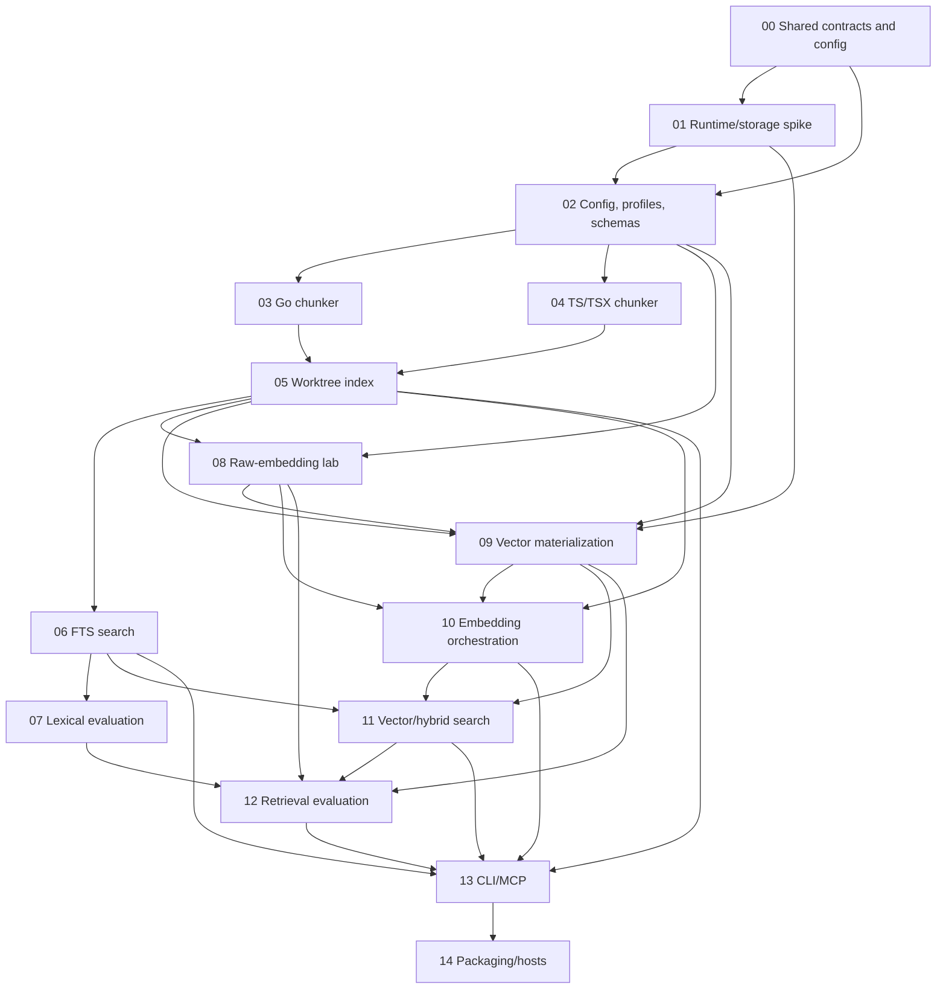

# cidx v1 Implementation Plan Index

- Status: explicit product decision now preserves a product-owned 1024-f32
  document source bank and fixes int8-only serving at 1024 by default or
  explicit compact 512. Binary/256 implementations are removed while their
  historical document evidence remains. All corpus-independent implementation
  and local package boundaries are reconciled; Phase 07 chi/RHF calibration is
  frozen and an unexposed confirmation set remains outstanding
- Canonical design: [Local Code Search MCP v1 Final Target Contract — Revision 4](../../local-code-search-mcp-v1-design-r4.md)
- Earlier designs: [original](../../local-code-search-mcp-v1-design.md), [r1](../../local-code-search-mcp-v1-design-r1.md), [r2](../../local-code-search-mcp-v1-design-r2.md), [r3](../../local-code-search-mcp-v1-design-r3.md)
- Execution protocol: [Implementation Execution and Context-Recovery Guide](EXECUTION-GUIDE.md)
- Evaluation and promotion contract: [cidx v1 Evaluation and Promotion Contract](EVALUATION-CONTRACT.md)
- Evaluation execution: [Retrieval Evaluation and Embedding Execution Plan](EVALUATION-EMBEDDING-EXECUTION-PLAN.md)
- Persistent state: [Phase Status Ledger](STATUS.md)
- Final corpus-independent review: [int8/source-profile implementation-to-design review](evidence/revision-4/int8-source-profile-final-review.md)
- Last updated: 2026-08-18

This directory is the executable implementation plan for cidx v1. It decomposes the canonical product contract into phase-owned packages, schemas, CLIs, validation work, and completion evidence. A design change must update this index, every affected phase, the dependency graph, the change-impact table, and the persistent status ledger together.

The existing completion records describe work performed against earlier revisions. They remain historical evidence, but they do not prove Revision 4 compliance. Before code work resumes, reconcile the renamed configuration fields, size limits, synchronous request policy, retry waits, and removed read-span/chunk caps, then identify the smallest affected phase validations that must be rerun.

Phase 02's config/profile/evaluation-wire reconciliation is recorded in [its R4 evidence](evidence/phase-02/revision-4.md). The later project-local source/state layout, path-free production/lab metadata migration, real chi/RHF preservation, and relocation proof are accepted in [the focused layout evidence](evidence/phase-02/project-local-layout-reconciliation.md); downstream algorithms remain unchanged.

Phase 08's shared byte-bounded synchronous executor and product source-bank/vector-free evaluation split are accepted in [current evidence](evidence/phase-08/int8-source-bank-reconciliation.md); the earlier executor boundary remains in [historical R4 evidence](evidence/phase-08/revision-4.md). Phase 10 owns production document publication integration, and Phase 11 owns request-local query integration.

Phase 10's production adapter consumes that executor with its resolved
request policy while preserving approval, plan freshness, transform/codec
publication, and store reproof. Focused offline checks, independent review, and
the main commit-boundary validation are accepted in [the Phase 10 R4
evidence](evidence/phase-10/revision-4.md). Phase 11 now owns request-local
query embedding and fallback integration.

Phase 11 reconciles the request-local query embedding adapter with that
accepted executor and the current int8-only product profile. Its snapshot,
collapse, RRF, fallback, and body-packaging algorithms remain frozen at the
historical accepted boundary. The obsolete comparison alias and vector-only
preflight surface are removed. Current acceptance is recorded in
[the int8-only evidence](evidence/phase-11/int8-only-query-search-reconciliation.md),
while the earlier executor boundary remains in
[historical R4 evidence](evidence/phase-11/revision-4.md).

Phase 12's corpus-independent provider-usage accounting, artifact wire, and
isolated lab migration are accepted in [its Revision 4 evidence](evidence/phase-12/revision-4.md).
Retrieval algorithms and normative evaluation schemas remain frozen. Official
corpus evidence and promotion remain blocked, but Phase 13 is eligible without
a corpus, provider, paid, or metric run.

Phase 13's current int8-only CLI/MCP reconciliation is accepted in
[current evidence](evidence/phase-13/int8-only-cli-mcp-reconciliation.md).
Phase 14's current local package checkpoint keeps the existing
MCP/search/index/store core frozen and is accepted in
[current int8 package evidence](evidence/phase-14/int8-profile-package-reconciliation.md).
It proves default 1024/int8, provider-free compact 512/int8, negative-only
Binary/256 handling, and source-bank-free serving from clean provenance
`5f4955e1499ee8896be5c825ef0fb9b3a52abb70`. It is not immutable
`release_candidate` evidence; the earlier local checkpoint remains historical.

cidx is a **local auxiliary search MCP** used alongside file readers, symbol tools, compilers, and tests. It is not a comprehensive code-knowledge system. The plan is bounded by free local AST/FTS indexing, explicit paid embeddings, a small MCP surface, caller-controlled inline source volume, and one serving-vector profile per repository.

## Resume here after context compaction

1. Read [`../../AGENTS.md`](../../AGENTS.md) and [`EXECUTION-GUIDE.md`](EXECUTION-GUIDE.md) completely.
2. Read [`EVALUATION-CONTRACT.md`](EVALUATION-CONTRACT.md) before changing any parser/retrieval/evaluation/promotion path.
3. Read [`STATUS.md`](STATUS.md); it is authoritative for active phase, owner, last checkpoint, blockers, and exact next action.
4. Read the active phase document completely, including its Context Recovery Checklist and decision log.
5. Verify prerequisite completion evidence by file path. Do not infer completion from chat history.
6. Inspect the workspace before editing and record the phase entry gate in `STATUS.md`.

If the documentation conflicts, reconcile it before changing code.

---

## 1. Phase status

Allowed states are `planned | in_progress | blocked | done`. A phase becomes `done` only when its completion-evidence section contains real artifacts and every downstream handoff input exists.

| Phase | Status | Document | Prerequisites | Primary deliverable | Completion evidence |
| --- | --- | --- | --- | --- | --- |
| 00 | done | [Shared contracts and configuration](00-shared-contracts-and-config.md) | none | Revision 4 field catalog, profile/hash hierarchy, migration policy, and change-impact rules | [Evidence](evidence/phase-00/README.md) |
| 01 | done | [Runtime and storage spike](01-runtime-storage-spike.md) | 00 | SQLite/FTS5/Tree-sitter packaging decisions, generation and codec evidence | [Evidence](01-runtime-storage-spike.md#11-completion-evidence) |
| 02 | done | [Configuration, profiles, and schemas](02-config-profiles-and-schemas.md) | 00, 01 | Default 1024/optional 512, fixed-int8 config/profile/evaluation wire, source-bank impact identity, and three-store ownership contract accepted | [Current int8/source evidence](evidence/phase-02/int8-source-profile-reconciliation.md); historical [R4 config/wire evidence](evidence/phase-02/revision-4.md) and [layout evidence](evidence/phase-02/project-local-layout-reconciliation.md) |
| 03 | done | [Go chunker](03-go-chunker.md) | 02 | Go function, method, and type chunks/projections | [Evidence](03-go-chunker.md#11-completion-evidence) |
| 04 | done | [TypeScript and TSX chunker](04-typescript-tsx-chunker.md) | 02 | Accepted path-derived retrieval labels and real-corpus overload correction; versioned full reindex handoff | [Evidence](evidence/phase-04/README.md) |
| 05 | done | [Worktree indexing pipeline](05-worktree-index-pipeline.md) | 03, 04, reconciled 02 | Remove the chunk-cap contract, inject `target_segment_bytes`, preserve atomic local reindex, and safely rekey only current int8-equivalent legacy vectors | [Current int8 reproof](evidence/phase-05/int8-serving-key-reproof.md) and [historical R4 evidence](evidence/phase-05/revision-4.md) |
| 06 | done | [FTS search](06-fts-search.md) | 05 | Contentless FTS, safe queries, BM25 chunk candidates | [Evidence](06-fts-search.md#11-completion-evidence) |
| 07 | in_progress | [Lexical evaluation](07-lexical-evaluation.md) | 06, corrected 04 inventory, reconciled 02/08/09/11 | Frozen 32-case chi/RHF calibration plus accepted provider-free relation/frontier diagnostics; separate unexposed confirmation remains | [Frontier-cap diagnostic](evidence/phase-07/relation-frontier-cap-diagnostic-r4.md), [frozen checkpoint](evidence/phase-07/dual-ai-calibration-freeze-r4.md), and [evidence index](evidence/phase-07/README.md) |
| 08 | done | [Document source-vector bank](08-raw-embedding-lab.md) | reconciled 02, 05 | Split durable product 1024-f32 source storage from vector-free evaluation run/artifact state while retaining the shared synchronous executor | [Current source-bank evidence](evidence/phase-08/int8-source-bank-reconciliation.md) and [historical R4 evidence](evidence/phase-08/revision-4.md) |
| 09 | done | [Vector materialization](09-vector-materialization.md) | reconciled 02, existing 01/05/08 | Int8-only 1024-default/512-optional transform, production v5 cache, atomic materialization, and direct scan boundary | [Current evidence](evidence/phase-09/int8-only-materialization-reconciliation.md) and [historical evidence](evidence/phase-09/README.md) |
| 10 | done | [Embedding orchestration and reconciliation](10-embedding-orchestration-and-reconciliation.md) | reconciled 02/09, existing 05/08 | Source-bank-first Voyage document publication, provider-free source reuse, and provider-only request accounting | [Current evidence](evidence/phase-10/source-bank-first-document-publication.md) and [historical R4 evidence](evidence/phase-10/revision-4.md) |
| 11 | done | [Vector and hybrid search](11-vector-and-hybrid-search.md) | reconciled 02/09/10, existing 06 | Int8-only request-local scan, RRF, fallback, and body packaging | [Current evidence](evidence/phase-11/int8-only-query-search-reconciliation.md) and [historical R4 evidence](evidence/phase-11/revision-4.md) |
| 12 | blocked | [Retrieval evaluation](12-retrieval-evaluation.md) | 07, reconciled 08, 09, 11 | Accepted int8-only corpus-independent adapter; official corpus evaluation and promotion remain externally gated | [Current evidence](evidence/phase-12/int8-only-evaluation-reconciliation.md) and [accepted R4 accounting evidence](evidence/phase-12/revision-4.md) |
| 13 | done | [CLI and MCP](13-cli-and-mcp.md) | reconciled 02/08/11 and existing Phase 12 core | Int8-only 1024-default init/help, local 512 rematerialization, and unchanged four-tool MCP | [Current evidence](evidence/phase-13/int8-only-cli-mcp-reconciliation.md) and [historical R4 evidence](evidence/phase-13/revision-4.md) |
| 14 | blocked | [Packaging and host integration](14-packaging-and-host-integration.md) | 13 | Current local package/verifier checkpoint accepted; official evaluation, assistant-use, and release-candidate evidence remain externally gated | [Current int8 package evidence](evidence/phase-14/int8-profile-package-reconciliation.md) and [historical local checkpoint](evidence/phase-14/revision-4.md) |

`STATUS.md` is the operational ledger. Keep this summary table synchronized with it whenever a phase changes state.

---

## 2. Dependency graph



- Phases 03 and 04 may run in parallel after Phase 02 because their file ownership is disjoint.
- The free lexical path in Phases 06–07 and the optional embedding path in Phases 08–10 may partially overlap after Phase 05 when prerequisites and ownership permit.
- Phase 07 has selected, pinned, and measured chi/RHF corpora. Its 32 exposed calibration cases now have fresh current-profile pools, independent ChatGPT/Grok source reviews, reconciliation, and whole-digest owner adoption under `owner-adopted-dual-ai-v1`; they retain `NO_INDEPENDENT_HUMAN_REVIEW` and cannot be reused as confirmation. A separate unexposed confirmation set remains required.
- Phase 12 chooses the initial serving profile from core retrieval evidence. It measures and reports results but does not impose a preselected universal numeric quality threshold.
- The external corpus gate blocks official Phase 12 evidence and promotion, not the corpus-independent Phase 13 CLI/MCP adapter implementation; those adapters must consume the frozen Phase 12 core rather than recreate it.
- Phase 13 completion requires the corpus-independent Phase 12 core/API and synthetic adapter parity, not an official corpus run or `core_retrieval` promotion result. Official core promotion is a Phase 14 release-candidate prerequisite.
- Phase 12 applies the frozen hard-gate contract. Numeric noninferiority margins are calibrated from repeated cidx baselines and frozen before confirmation; no external threshold is copied into the plan.
- MCP and host integration follow core retrieval evaluation because they are adapters and must not alter ranking behavior. Phase 14 then adds paired assistant-use evidence for cidx's marginal product value beside existing tools.

---

## 3. End-to-end execution flows

### 3.1 Free local path

```text
live working tree
-> enumerate files and calculate SHA-256
-> parse every changed file in full
-> produce function/method/type chunks, projections, and segments
-> prepare an FTS delta
-> publish one active generation in one transaction
-> make FTS search immediately available
```

`cidx index` and MCP `reindex` perform only this path and never call Voyage AI. `search` never refreshes the index automatically.

### 3.2 Initial development and evaluation path

```text
active document canonical input from an explicitly resolved source root
-> request Voyage document-role 1024-dimensional float32 embedding
-> persist document f32 in the product source bank at <state_root>/db/embeddings.db
-> choose one candidate serving dimension/reducer/normalizer in project config
-> apply the fixed cidx-owned `int8` codec
-> run cidx index to reconcile active profile and segment keys
-> materialize the current profile locally and publish one serving-vector set
-> create each evaluation query as a Voyage query-role 1024-dimensional vector in memory
-> change config -> index -> materialize for each sequential candidate run
-> reapply the selected config, reconcile, and prepare production vector_cache
```

This supports ordinary dimension changes and economical repository-specific quality exploration. Query f32 is never persisted. Serving/search does not open the product source bank or lab, and the active int8 target remains authoritative if either auxiliary store is unavailable.

Normal use resolves `state_root=<source_root>/.cidx` and production SQLite to
`<state_root>/db/index.db`. The cidx development workspace keeps disposable
corpus checkouts under `.cidx/test/corpora/<corpus-id>` and preserved named
state under `.cidx/test/states/<corpus-id>`. Both paths are supplied to the
same application/index/search/store assembly; no evaluation-only search engine
exists.

### 3.3 Normal serving path

```text
new document input
-> Voyage document-role 1024-dimensional float32 embedding
-> durably store immutable source f32 in the product source bank
-> shared active-profile transform
-> encode with the fixed cidx int8 codec
-> persist the selected int8 serving vector

hybrid query
-> Voyage query-role 1024-dimensional float32 embedding
-> same shared transform
-> scan in memory/bounded buffers
-> discard query f32
```

Runtime observes one profile. `serving_dimensions`, reducer, normalizer, metric, and fixed int8 codec come only from validated `ResolvedConfig`. The product document source bank is neither a runtime data source nor a fallback.

### 3.4 Revision 4 fixed operational target

| Area | Target contract |
| --- | --- |
| Source eligibility | one regular UTF-8 source file, at most 1 MiB |
| Chunking | whole named function/method/type; no configurable chunk byte cap |
| Segmentation | AST-boundary target of 1,024 bytes; evaluate 768/1,024/1,536 |
| Provider source | `voyage-code-4`, explicit 1024-dimensional float, role-aware, no truncation |
| Serving dimensions | 1024 by default or explicit compact 512; unrelated to source scope |
| Storage codec | fixed cidx-owned `int8`; no selector |
| Search | `fts` by default; hybrid is explicit and may incur query-embedding cost |
| Provider execution | regular synchronous endpoint only; no asynchronous Batch Inference |
| Request grouping | 128 inputs, 256 KiB aggregate input, concurrency 4, timeout 30 seconds |
| Retry | initial attempt plus three transient retries after 10/20/30 seconds |
| Inline source | required caller budget; server default 64 KiB; executable ceiling 1 MiB |
| `read_span` | no line-count cap; complete byte-bounded range or typed error |

The retry schedule is linear/staged, not exponential. Request grouping is not Voyage Batch Inference. The 1 MiB source-file ceiling and 1 MiB inline executable ceiling are separate named contracts even though they currently share a numeric value.

---

## 4. Cross-phase invariants

1. **Cost boundary:** `index`, `reindex`, status, read-span, and FTS search never call an embedding API. Paid document and query calls require explicit approved paths.
2. **Live-file boundary:** indexing reads live working-tree bytes, not HEAD blobs. It includes tracked and untracked, non-ignored source files.
3. **Generation visibility:** one search reads FTS statistics/candidates, chunks, segments, vectors, coverage, body, and manifest from one committed active generation.
4. **Atomic publish:** failure while preparing or publishing a new generation does not damage the previously searchable generation.
5. **Single serving profile:** search reads one active vector-space/storage profile. Dimension or codec mismatch fails closed or falls back to FTS as documented.
6. **Shared transform:** document materialization and query transformation use the same reducer, normalizer, implementation version, and fingerprint.
7. **Serving/source/lab isolation:** `index.db` stores only the active cidx-owned int8 serving vectors. `embeddings.db` stores immutable document-role 1024-f32 source rows. `serve` and `search` open neither the source bank nor evaluation state.
8. **Bounded source purpose:** the product-owned 1024-dimensional document f32 bank exists for provider-free document reuse and 1024/512 rematerialization. It is not a query cache, search fallback, or multi-profile runtime authority.
9. **Derived readiness:** `ready` derives only from a valid vector row joined to an active key; no mutable ready flag is authoritative.
10. **Source-volume control:** `max_inline_bytes` limits body bytes without changing rank or the identity/order/count of the up-to-k result set.
11. **Freshness:** search bodies come from the indexed snapshot. Live hashes are separate annotations, and `read_span` refuses a mismatched expected hash.
12. **Small stable surface:** MCP exposes only `status`, `search`, `read_span`, and `reindex`. Development lab commands are not MCP tools.
13. **SQLite authority:** the persistent index is authoritative. Go heap caches may be bounded accelerators but never a second source of truth.
14. **Stage-separated evidence:** parser, FTS, dense, collapse, RRF, body packaging, assistant use, and operations retain independent denominators and first-loss states. No weighted total replaces them.
15. **Dual dense references:** frozen source-backed relevance under the recorded review authority measures usefulness; exhaustive serving-f32 ranking measures current int8 fidelity. The solo-project authority is `OWNER_ADOPTED_DUAL_AI_REVIEW` with `NO_INDEPENDENT_HUMAN_REVIEW`, never `HUMAN_REVIEWED`. Historical Binary evidence is not an executable arm. HNSW/ANN metrics are excluded.
16. **Paired promotion:** calibration selects settings and margins; only frozen compatible confirmation runs may vote for promotion. Activation is not quality admission.

---

## 5. Single source of truth for settings and constants

No module independently rereads config or duplicates dimension/codec values.

```text
config.json
-> RawConfig
-> resolve defaults
-> strict validation
-> immutable ResolvedConfig
-> inject the required typed profile into each service
```

### 5.1 Values managed in config

- embedding model and selected `serving_dimensions`;
- supported reducer, normalizer, metric, and the fixed storage codec identity (`int8`);
- enabled supported languages;
- source-file eligibility and AST-aware segment target;
- synchronous embedding request grouping, retry, timeout, and concurrency limits;
- FTS field weights, candidate/return k, and RRF parameters;
- paid-query permission and default search mode;
- MCP inline-body safety limit and byte-bounded read-span policy;
- non-profile operational settings such as log level.

A config key does not imply arbitrary algorithm extensibility. Every enum value must map to an implementation owned by the binary.

### 5.2 Code-owned central constants and registries

- database schema/migration and MCP wire-schema versions;
- hash domain separators and canonical byte framing;
- provider identity `voyage-official`, endpoint `https://api.voyageai.com/v1/embeddings`, and credential variable name `VOYAGE_API_KEY`;
- `voyage-code-4` source dimension 1024 and allowed targets `{1024, 512}`;
- document/query `input_type`, `output_dtype=float`, `truncation=false`, and adapter contract version;
- codec blob byte order, rounding, scale layout, and algorithm version;
- supported enums, absolute safety ceilings, error codes, and generation-publish protocol.

The config records the fixed `storage_codec=int8` identity for fingerprinting;
users cannot select another codec or invent an implementation version such as
`quantization_version: 7`.

### 5.3 Change-impact table

| Change | Active-key impact | Required work | Possible API cost |
| --- | --- | --- | --- |
| chunker/projection/segment/FTS rules | index profile | full or affected local reindex | none |
| canonical input byte rules | input hash | recompute input keys and embed changed inputs | yes |
| Voyage provider/model/1024 source space/role contract | source profile | document embedding | yes |
| supported serving dimension | vector-space profile | rematerialize from compatible product source bank, otherwise embed missing sources | conditional |
| reducer/normalizer/metric | vector-space profile | rematerialize from the same compatible product source rows | none when sources exist |
| fixed int8 implementation/profile version | storage profile | rematerialize from compatible product source rows | none when sources exist |
| candidate/return k or RRF | none | reload/restart | none |
| inline-body or read-span byte policy | none | serve reload/restart | none |
| schema version | database | migration | none |
| pre-Revision-4 config/profile shape | new strict config plus new index/vector profile fingerprints | reject legacy config with a typed mapping; preserve the DB; local reindex and compatible local rematerialization/rekey only when equivalence is proven | conditional only when compatible raw/vector evidence is unavailable |

---

## 6. Phase execution rules

For every phase:

1. Verify prerequisite completion evidence and real handoff artifacts.
2. Complete the phase's Context Recovery Checklist and record entry in `STATUS.md`.
3. Resolve only decisions that block the phase; record them in the phase decision log.
4. Implement pure core and storage contracts before public adapters when the phase permits.
5. Check failure, rollback, concurrency, and security behavior together with the happy path.
6. Record actual commands, results, and artifact paths in the completion-evidence section.
7. Record checks not run and remaining risks explicitly.
8. Name every downstream handoff type, schema, fixture, manifest, and report by real path.
9. Update this index and `STATUS.md` before pausing or changing phase state.

A checklist is work inventory, not completion evidence. Existing code without required schema snapshots, transcripts, failure-path evidence, or handoff artifacts is not `done`.

### 6.1 Open-source corpus gate

The user will select evaluation repositories. The implementation must not choose them automatically.

- Commit reproducibility manifests, not source copies or machine-specific paths.
- Each manifest records corpus ID, upstream URL, pinned commit, license, language slices, root subdirectory, include/exclude policy, and expected tree/content hash.
- Bind corpus IDs to user-managed local checkouts through ignored local state or an explicit development CLI argument.
- Verify clean worktree, commit, hash, license record, expected file inventory, and absence of credentials before an official run.
- Do not clone, update, or embed a corpus without explicit user approval.
- Report Go, TypeScript, TSX, and mixed slices separately as applicable; do not publish aggregate metrics without slice counts.

---

## 7. Decisions intentionally deferred

- Product serving dimension: 1024 is the default and 512 is the explicit compact option. The provider source response is durably preserved in the product document source bank. Production serving storage is fixed to cidx-owned `int8`; Binary and 256 are historical document evidence only and have no product code path.
- Numeric hit@k, MRR, p50, or p95 acceptance thresholds: measure, but do not predefine them as v1 release gates.
- ANN/HNSW: decide only after measuring the practical codec-aware full-scan limit.
- Additional languages such as Python.
- Automatic file watching and automatic post-commit hook installation.
- User-scoped or multi-repository MCP daemon.
- Long-term policy for a fixed bundled embedding model versus externally supplied vectors.
- Productized raw-embedding retention, synchronization, or backup.
- Query-embedding cache.

Do not introduce a deferred item implicitly for implementation convenience.

---

## 8. Change log

| Date | Change | Reason |
| --- | --- | --- |
| 2026-08-17 | Made 1024/int8 the default, retained compact 512/int8, productized durable document source-1024 f32, and removed Binary/256 code paths | Preserve maximum measured int8 fidelity by default while making dimension changes provider-free and keeping retired evidence document-only |
| 2026-08-14 | Created the phase-oriented implementation plan | Decompose the r3 contract into executable work and evidence |
| 2026-08-14 | Separated the 1024-dimensional document-f32 lab from runtime serving | Reduce repeated initial evaluation cost without creating a multi-profile runtime |
| 2026-08-14 | Excluded query-raw persistence | Questions change, and a persistent query cache is not a product goal |
| 2026-08-14 | Selected the official Voyage AI `voyage-code-4` provider/model | Start from a code-retrieval model while retaining repository-specific evaluation |
| 2026-08-14 | Fixed v1 source dimension to 1024 | Compare only 256, 512, and 1024 from one source space |
| 2026-08-14 | Added repository-persistent context-recovery protocol and status ledger | Make phase execution resumable without conversation memory |
| 2026-08-14 | Made evaluation corpora user-selected, pinned open-source inputs | Preserve licensing, reproducibility, and explicit paid-operation control |
| 2026-08-14 | Changed production quantization to cidx-owned `binary` by default and retained `int8` as the only alternative | Reduce the serving representation while preserving one explicit codec per active profile and the isolated 1024-f32 evaluation source |
| 2026-08-14 | Added a cross-phase evaluation and promotion contract based on the kb-metric advisory | Make implementation correctness, codec fidelity, RRF contribution, body survival, marginal assistant usefulness, and hard-gate promotion measurable before coding proceeds |
| 2026-08-15 | Initialized Git and entered Phase 00 | Establish recoverable repository state and finish shared contracts before implementation code |
| 2026-08-15 | Fixed RFC 8785 JCS and completed Phase 00 | Make semantic fingerprints reproducible across implementations and unblock runtime/storage decisions |
| 2026-08-15 | Resumed implementation at the Revision 4 reconciliation boundary | Supersede pre-R4 config/profile evidence without rewriting history, then revalidate only the affected phases |
