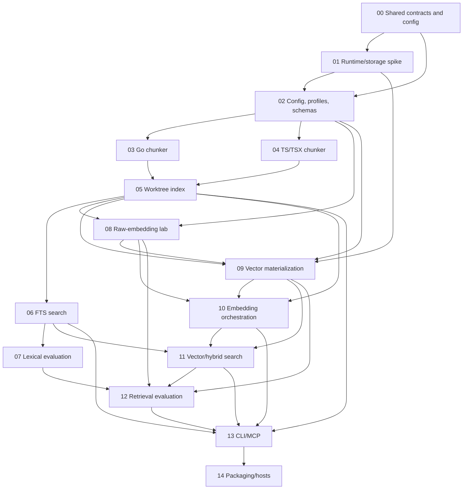

# cidx v1 Implementation Plan Index

- Status: implementation in progress — Phases 00–06 and 08–11 complete; Phase 07 reusable infrastructure is blocked on user-selected corpus manifests and Phase 12 is next for evaluation infrastructure
- Canonical design: [Local Code Search MCP v1 Design — Revision 3](../../local-code-search-mcp-v1-design-r3.md)
- Earlier designs: [original](../../local-code-search-mcp-v1-design.md), [r1](../../local-code-search-mcp-v1-design-r1.md), [r2](../../local-code-search-mcp-v1-design-r2.md)
- Execution protocol: [Implementation Execution and Context-Recovery Guide](EXECUTION-GUIDE.md)
- Evaluation and promotion contract: [cidx v1 Evaluation and Promotion Contract](EVALUATION-CONTRACT.md)
- Persistent state: [Phase Status Ledger](STATUS.md)
- Last updated: 2026-08-15

This directory is the executable implementation plan for cidx v1. It decomposes the canonical product contract into phase-owned packages, schemas, CLIs, validation work, and completion evidence. A design change must update this index, every affected phase, the dependency graph, the change-impact table, and the persistent status ledger together.

cidx is a **local auxiliary search MCP** used alongside file readers, symbol tools, compilers, and tests. It is not a comprehensive code-knowledge system. The plan is bounded by free local AST/FTS indexing, explicit paid embeddings, a small MCP surface, caller-controlled inline source volume, and one serving-vector profile per repository.

## Resume here after context compaction

1. Read [`../../AGENTS.md`](../../AGENTS.md) and [`EXECUTION-GUIDE.md`](EXECUTION-GUIDE.md) completely.
2. Read [`EVALUATION-CONTRACT.md`](EVALUATION-CONTRACT.md) before changing any parser/retrieval/evaluation/promotion path.
3. Read [`STATUS.md`](STATUS.md); it is authoritative for active phase, owner, last checkpoint, blockers, and exact next action.
4. Read the active phase document completely, including its Context Recovery Checklist and decision log.
5. Verify prerequisite completion evidence by file path. Do not infer completion from chat history.
6. Inspect the workspace before editing and record the phase entry gate in `STATUS.md`.

If the documentation conflicts, reconcile it before changing code.

---

## 1. Phase status

Allowed states are `planned | in_progress | blocked | done`. A phase becomes `done` only when its completion-evidence section contains real artifacts and every downstream handoff input exists.

| Phase | Status | Document | Prerequisites | Primary deliverable | Completion evidence |
| --- | --- | --- | --- | --- | --- |
| 00 | done | [Shared contracts and configuration](00-shared-contracts-and-config.md) | none | Boundaries, typed config, profile/hash hierarchy, change-impact rules | [Evidence](00-shared-contracts-and-config.md#11-completion-evidence) |
| 01 | done | [Runtime and storage spike](01-runtime-storage-spike.md) | 00 | SQLite/FTS5/Tree-sitter packaging decisions, generation and codec evidence | [Evidence](01-runtime-storage-spike.md#11-completion-evidence) |
| 02 | done | [Configuration, profiles, and schemas](02-config-profiles-and-schemas.md) | 00, 01 | `ResolvedConfig`, fingerprints, production/lab migrations | [Evidence](02-config-profiles-and-schemas.md#11-completion-evidence) |
| 03 | done | [Go chunker](03-go-chunker.md) | 02 | Go function, method, and type chunks/projections | [Evidence](03-go-chunker.md#11-completion-evidence) |
| 04 | done | [TypeScript and TSX chunker](04-typescript-tsx-chunker.md) | 02 | TS/TSX function, method, and type chunks/projections | [Evidence](04-typescript-tsx-chunker.md#11-completion-evidence) |
| 05 | done | [Worktree indexing pipeline](05-worktree-index-pipeline.md) | 03, 04 | Live-file enumeration, incremental plan, atomic generation publish | [Evidence](05-worktree-index-pipeline.md#11-completion-evidence) |
| 06 | done | [FTS search](06-fts-search.md) | 05 | Contentless FTS, safe queries, BM25 chunk candidates | [Evidence](06-fts-search.md#11-completion-evidence) |
| 07 | blocked | [Lexical evaluation](07-lexical-evaluation.md) | 06 | Reusable lexical evaluation infrastructure; official labels and baseline evidence await user-selected corpus manifests and bindings | [Evidence](evidence/phase-07/README.md) |
| 08 | done | [Initial raw-embedding lab](08-raw-embedding-lab.md) | 02, 05 | Isolated 1024-dimensional document f32 capture | [Evidence](08-raw-embedding-lab.md#11-completion-evidence) |
| 09 | done | [Vector materialization](09-vector-materialization.md) | 01, 02, 05, 08 | Shared reduction/normalization, binary/int8 codecs, and selected-profile publish | [Evidence](09-vector-materialization.md#11-completion-evidence) |
| 10 | done | [Embedding orchestration and reconciliation](10-embedding-orchestration-and-reconciliation.md) | 05, 08, 09 | General embedding, cost/failure handling, profile reconciliation | [Evidence](evidence/phase-10/README.md) |
| 11 | done | [Vector and hybrid search](11-vector-and-hybrid-search.md) | 06, 09, 10 | Query transform, codec-aware scan, segment collapse, RRF, fallback, shared body packaging | [Evidence](evidence/phase-11/README.md) |
| 12 | planned | [Retrieval evaluation](12-retrieval-evaluation.md) | 07, 08, 09, 11 | Paired dimension/codec/lane/RRF/package evidence and scoped core-retrieval promotion result | [Evidence](12-retrieval-evaluation.md#11-completion-evidence) |
| 13 | planned | [CLI and MCP](13-cli-and-mcp.md) | 05, 06, 10, 11, 12 | Stable CLI, four MCP tools, concurrent dispatch | [Evidence](13-cli-and-mcp.md#11-completion-evidence) |
| 14 | planned | [Packaging and host integration](14-packaging-and-host-integration.md) | 13 | Distributable binary, project-scoped host examples, paired marginal assistant-use evidence, and scoped release-candidate result | [Evidence](14-packaging-and-host-integration.md#11-completion-evidence) |

`STATUS.md` is the operational ledger. Keep this summary table synchronized with it whenever a phase changes state.

---

## 2. Dependency graph



- Phases 03 and 04 may run in parallel after Phase 02 because their file ownership is disjoint.
- The free lexical path in Phases 06–07 and the optional embedding path in Phases 08–10 may partially overlap after Phase 05 when prerequisites and ownership permit.
- Phase 07 cannot produce an official baseline until the user has selected open-source corpora and reproducible manifests exist.
- Phase 12 chooses the initial serving profile from core retrieval evidence. It measures and reports results but does not impose a preselected universal numeric quality threshold.
- Phase 12 applies the frozen hard-gate contract. Numeric noninferiority margins are calibrated from repeated cidx baselines and frozen before confirmation; no external threshold is copied into the plan.
- MCP and host integration follow core retrieval evaluation because they are adapters and must not alter ranking behavior. Phase 14 then adds paired assistant-use evidence for cidx's marginal product value beside existing tools.

---

## 3. End-to-end execution flows

### 3.1 Free local path

```text
live working tree
-> enumerate files and calculate SHA-256
-> parse every changed file in full
-> produce function/method/type chunks, projections, and segments
-> prepare an FTS delta
-> publish one active generation in one transaction
-> make FTS search immediately available
```

`cidx index` and MCP `reindex` perform only this path and never call Voyage AI. `search` never refreshes the index automatically.

### 3.2 Initial development and evaluation path

```text
active document canonical input
-> request Voyage document-role 1024-dimensional float32 embedding
-> persist document f32 in .cidx/lab/embeddings.db
-> choose one candidate target dimension/reducer/normalizer in project config
-> use the default `binary` codec or explicitly select the only alternative, `int8`
-> run cidx index to reconcile active profile and segment keys
-> materialize the current profile locally and publish one serving-vector set
-> create each evaluation query as a Voyage query-role 1024-dimensional vector in memory
-> change config -> index -> materialize for each sequential candidate run
-> reapply the selected config, reconcile, and prepare production vector_cache
```

This is a development aid for economical repository-specific quality exploration. Query f32 is never persisted. Production does not open the lab DB and does not require the raw bank after evaluation.

### 3.3 Normal serving path

```text
new document input
-> Voyage document-role 1024-dimensional float32 embedding
-> shared active-profile transform
-> encode with the selected cidx storage codec (`binary` by default, or `int8`)
-> persist the selected quantized serving vector
-> discard source f32

hybrid query
-> Voyage query-role 1024-dimensional float32 embedding
-> same shared transform
-> scan in memory/bounded buffers
-> discard query f32
```

Runtime observes one profile. `target_dimensions`, reducer, normalizer, metric, and codec come only from validated `ResolvedConfig`. The lab raw bank is neither a runtime data source nor a fallback.

---

## 4. Cross-phase invariants

1. **Cost boundary:** `index`, `reindex`, status, read-span, and FTS search never call an embedding API. Paid document and query calls require explicit approved paths.
2. **Live-file boundary:** indexing reads live working-tree bytes, not HEAD blobs. It includes tracked and untracked, non-ignored source files.
3. **Generation visibility:** one search reads FTS statistics/candidates, chunks, segments, vectors, coverage, body, and manifest from one committed active generation.
4. **Atomic publish:** failure while preparing or publishing a new generation does not damage the previously searchable generation.
5. **Single serving profile:** search reads one active vector-space/storage profile. Dimension or codec mismatch fails closed or falls back to FTS as documented.
6. **Shared transform:** document materialization and query transformation use the same reducer, normalizer, implementation version, and fingerprint.
7. **Runtime/lab isolation:** production stores only the active profile's cidx-owned `binary` or `int8` serving vectors. `binary` is the v1 default. `serve`, `search`, and production storage never import, open, or attach the lab DB.
8. **Bounded raw purpose:** the 1024-dimensional document f32 bank exists only to reduce repeated initial evaluation cost. It is not a query cache, long-term raw lake, or multi-profile runtime.
9. **Derived readiness:** `ready` derives only from a valid vector row joined to an active key; no mutable ready flag is authoritative.
10. **Source-volume control:** `max_inline_bytes` limits body bytes without changing rank or the identity/order/count of the up-to-k result set.
11. **Freshness:** search bodies come from the indexed snapshot. Live hashes are separate annotations, and `read_span` refuses a mismatched expected hash.
12. **Small stable surface:** MCP exposes only `status`, `search`, `read_span`, and `reindex`. Development lab commands are not MCP tools.
13. **SQLite authority:** the persistent index is authoritative. Go heap caches may be bounded accelerators but never a second source of truth.
14. **Stage-separated evidence:** parser, FTS, dense, collapse, RRF, body packaging, assistant use, and operations retain independent denominators and first-loss states. No weighted total replaces them.
15. **Dual dense references:** human relevance measures usefulness; exhaustive target-f32 ranking measures binary/int8 fidelity. HNSW/ANN metrics are excluded.
16. **Paired promotion:** calibration selects settings and margins; only frozen compatible confirmation runs may vote for promotion. Activation is not quality admission.

---

## 5. Single source of truth for settings and constants

No module independently rereads config or duplicates dimension/codec values.

```text
config.json
-> RawConfig
-> resolve defaults
-> strict validation
-> immutable ResolvedConfig
-> inject the required typed profile into each service
```

### 5.1 Values managed in config

- embedding model and selected `target_dimensions`;
- supported reducer, normalizer, metric, and storage codec ID (`binary | int8`);
- enabled supported languages;
- source-file, chunk, and segment limits;
- embedding batch, retry, timeout, and concurrency limits;
- FTS field weights, candidate/return k, and RRF parameters;
- paid-query permission and default search mode;
- MCP inline/read safety limit;
- non-profile operational settings such as log level.

A config key does not imply arbitrary algorithm extensibility. Every enum value must map to an implementation owned by the binary.

### 5.2 Code-owned central constants and registries

- database schema/migration and MCP wire-schema versions;
- hash domain separators and canonical byte framing;
- provider identity `voyage-official`, endpoint `https://api.voyageai.com/v1/embeddings`, and credential variable name `VOYAGE_API_KEY`;
- `voyage-code-4` source dimension 1024 and allowed targets `{256, 512, 1024}`;
- document/query `input_type`, `output_dtype=float`, `truncation=false`, and adapter contract version;
- codec blob byte order, rounding, scale layout, and algorithm version;
- binary bit-value convention, packing order, padding validation, and matching score algorithm/version;
- supported enums, absolute safety ceilings, error codes, and generation-publish protocol.

Users select a supported `storage_codec` ID; they cannot invent an implementation version such as `quantization_version: 7`.

### 5.3 Change-impact table

| Change | Active-key impact | Required work | Possible API cost |
| --- | --- | --- | --- |
| chunker/projection/segment/FTS rules | index profile | full or affected local reindex | none |
| canonical input byte rules | input hash | recompute input keys and embed changed inputs | yes |
| Voyage provider/model/1024 source space/role contract | source profile | document embedding | yes |
| supported target dimension | vector-space profile | rematerialize from compatible lab raw, otherwise embed | conditional |
| reducer/normalizer/metric | vector-space profile | rematerialize from the same compatible source raw | none when raw exists |
| storage codec (`binary | int8`) | storage profile | rematerialize from compatible vector-space f32 | none when raw exists |
| candidate/return k or RRF | none | reload/restart | none |
| inline/read cap | none | serve reload/restart | none |
| schema version | database | migration | none |

---

## 6. Phase execution rules

For every phase:

1. Verify prerequisite completion evidence and real handoff artifacts.
2. Complete the phase's Context Recovery Checklist and record entry in `STATUS.md`.
3. Resolve only decisions that block the phase; record them in the phase decision log.
4. Implement pure core and storage contracts before public adapters when the phase permits.
5. Check failure, rollback, concurrency, and security behavior together with the happy path.
6. Record actual commands, results, and artifact paths in the completion-evidence section.
7. Record checks not run and remaining risks explicitly.
8. Name every downstream handoff type, schema, fixture, manifest, and report by real path.
9. Update this index and `STATUS.md` before pausing or changing phase state.

A checklist is work inventory, not completion evidence. Existing code without required schema snapshots, transcripts, failure-path evidence, or handoff artifacts is not `done`.

### 6.1 Open-source corpus gate

The user will select evaluation repositories. The implementation must not choose them automatically.

- Commit reproducibility manifests, not source copies or machine-specific paths.
- Each manifest records corpus ID, upstream URL, pinned commit, license, language slices, root subdirectory, include/exclude policy, and expected tree/content hash.
- Bind corpus IDs to user-managed local checkouts through ignored local state or an explicit development CLI argument.
- Verify clean worktree, commit, hash, license record, expected file inventory, and absence of credentials before an official run.
- Do not clone, update, or embed a corpus without explicit user approval.
- Report Go, TypeScript, TSX, and mixed slices separately as applicable; do not publish aggregate metrics without slice counts.

---

## 7. Decisions intentionally deferred

- Initial serving target dimension: choose after Phase 12 evaluation. The initial storage codec defaults to `binary`; `int8` remains the only alternative v1 codec.
- Numeric hit@k, MRR, p50, or p95 acceptance thresholds: measure, but do not predefine them as v1 release gates.
- ANN/HNSW: decide only after measuring the practical codec-aware full-scan limit.
- Additional languages such as Python.
- Automatic file watching and automatic post-commit hook installation.
- User-scoped or multi-repository MCP daemon.
- Long-term policy for a fixed bundled embedding model versus externally supplied vectors.
- Productized raw-embedding retention, synchronization, or backup.
- Query-embedding cache.

Do not introduce a deferred item implicitly for implementation convenience.

---

## 8. Change log

| Date | Change | Reason |
| --- | --- | --- |
| 2026-08-14 | Created the phase-oriented implementation plan | Decompose the r3 contract into executable work and evidence |
| 2026-08-14 | Separated the 1024-dimensional document-f32 lab from runtime serving | Reduce repeated initial evaluation cost without creating a multi-profile runtime |
| 2026-08-14 | Excluded query-raw persistence | Questions change, and a persistent query cache is not a product goal |
| 2026-08-14 | Selected the official Voyage AI `voyage-code-4` provider/model | Start from a code-retrieval model while retaining repository-specific evaluation |
| 2026-08-14 | Fixed v1 source dimension to 1024 | Compare only 256, 512, and 1024 from one source space |
| 2026-08-14 | Added repository-persistent context-recovery protocol and status ledger | Make phase execution resumable without conversation memory |
| 2026-08-14 | Made evaluation corpora user-selected, pinned open-source inputs | Preserve licensing, reproducibility, and explicit paid-operation control |
| 2026-08-14 | Changed production quantization to cidx-owned `binary` by default and retained `int8` as the only alternative | Reduce the serving representation while preserving one explicit codec per active profile and the isolated 1024-f32 evaluation source |
| 2026-08-14 | Added a cross-phase evaluation and promotion contract based on the kb-metric advisory | Make implementation correctness, codec fidelity, RRF contribution, body survival, marginal assistant usefulness, and hard-gate promotion measurable before coding proceeds |
| 2026-08-15 | Initialized Git and entered Phase 00 | Establish recoverable repository state and finish shared contracts before implementation code |
| 2026-08-15 | Fixed RFC 8785 JCS and completed Phase 00 | Make semantic fingerprints reproducible across implementations and unblock runtime/storage decisions |
