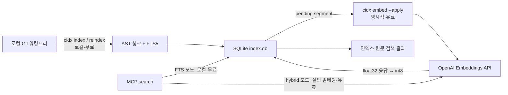

# 로컬 코드 검색 MCP v1 설계 — 1차 정리본

상태: 구현 전 1차 설계안
작성일: 2026-08-14
가칭 바이너리: `cidx`
원본 초안: `local-code-search-mcp-v1-design.md`

이 문서는 기존 초안을 수정한 문서가 아니다. 지금까지 합의한 내용을 구현 계약 중심으로 다시 정리한 독립 문서다. 수치와 세부 라이브러리는 구현·평가 과정에서 조정할 수 있지만, 비용 경계와 데이터 일관성 계약은 v1에서 바꾸지 않는다.

---

## 1. 제품 정의

`cidx`는 로컬 Git 저장소의 Go/TypeScript 코드를 함수 중심으로 검색하기 위한 작은 MCP 서버다.

> 실제 워킹트리의 함수·메서드·타입을 AST로 잘라 SQLite FTS5에 무료로 인덱싱하고, 사용자가 명시적으로 선택한 경우에만 OpenAI 임베딩을 추가하여 검색 결과로 원문과 위치를 반환한다.

핵심 목표는 다음 세 가지다.

1. 코딩 에이전트가 저장소 전체를 읽지 않고 관련 함수·메서드·타입 원문을 바로 찾게 한다.
2. 로컬 인덱싱과 유료 API 호출을 분리하여 언제 비용이 발생하는지 명확하게 한다.
3. 그래프·위키·리뷰 자동화 없이 검색 품질을 먼저 측정하고 고정한다.

### 1.1 출발점과 차이

아이디어의 출발점은 [code-review-graph](https://github.com/tirth8205/code-review-graph)다. Tree-sitter로 코드를 구조화하고 MCP를 통해 필요한 부분만 읽게 한다는 문제 설정은 가져온다.

다음 부분은 가져오지 않는다.

- 호출 그래프를 주 검색 경로로 쓰는 방식
- 노드 이름과 짧은 메타데이터 중심의 임베딩
- 커뮤니티 탐지, 리스크 점수, 위키 생성
- 많은 MCP 도구를 한 서버에 노출하는 방식
- 저장소 전체와 소수 검색 결과만 비교한 토큰 절감 수치

v1의 검색 근거는 그래프 노드가 아니라 코드 본문이다. 그래프는 검색 품질이 닫힌 뒤 별도 기능으로 검토한다.

---

## 2. v1 범위

### 2.1 포함

- Git 저장소 한 개를 루트로 사용하는 로컬 인덱스
- Go, TypeScript, TSX 청킹
- 함수, 메서드, 타입 단위의 검색
- SQLite FTS5 렉시컬 검색
- 공식 OpenAI Embeddings API를 사용한 선택적 벡터 검색
- 256차원 int8 벡터의 전체 스캔
- FTS와 벡터 순위의 RRF 결합
- stdio MCP 서버
- `status`, `search`, `read_span`, `reindex` 네 개 MCP 도구
- 수동 인덱싱과 사용자가 기존 post-commit hook에 연결할 수 있는 로컬 인덱싱 명령

### 2.2 제외

- 파일 저장 감시와 실시간 인덱싱
- 자동 임베딩과 암묵적 API 과금
- HNSW 등 ANN 인덱스
- Python과 그 외 언어의 공식 지원
- 호출 그래프, 영향 반경, 리뷰, 위키, 요약
- OpenAI 외 임베딩 제공자
- Azure OpenAI, OpenAI-compatible gateway, custom `base_url`
- 사용자 범위 MCP 등록과 멀티레포 서버
- 호스트 설정 파일을 자동으로 수정하는 installer
- 검색 결과를 LLM으로 다시 작성하는 단계

---

## 3. 시스템 경계

`index`, `embed`, `search`는 서로 다른 작업이다.



| 동작 | 워킹트리 탐색 | SQLite 쓰기 | OpenAI API | 기본 비용 |
| --- | --- | --- | --- | --- |
| `cidx index` | 전체 대상 파일 확인 | AST·FTS·segment 갱신 | 호출하지 않음 | 로컬 |
| MCP `reindex` | `cidx index`와 동일 | AST·FTS·segment 갱신 | 호출하지 않음 | 로컬 |
| `cidx embed` | 하지 않음 | 하지 않음 | 호출하지 않음 | 예상치만 계산 |
| `cidx embed --apply` | 하지 않음 | int8 벡터 저장 | 문서 segment 임베딩 | 유료 |
| `search(mode=fts)` | 결과 파일의 freshness만 확인 | 하지 않음 | 호출하지 않음 | 로컬 |
| `search(mode=hybrid)` | 결과 파일의 freshness만 확인 | 하지 않음 | 질의 임베딩 | 유료 |

`search`는 `index`를 자동 실행하지 않는다. `index`도 임베딩 API를 호출하지 않는다. 이 두 규칙이 비용과 일관성의 기본 경계다.

---

## 4. 저장소 스냅샷과 freshness

### 4.1 인덱스 대상은 HEAD가 아니라 실제 파일이다

`cidx index`는 실행 시점에 디스크에 있는 워킹트리 파일을 읽는다. Git HEAD는 파일 내용을 가져오는 원본이 아니며, 실행 당시 상태를 설명하는 참고 정보로만 저장한다.

따라서 일부 파일만 커밋한 뒤 post-commit hook이 실행되면, 다른 파일에 남아 있는 미커밋 수정도 인덱스 대상이다. 인덱스의 의미는 다음과 같다.

> 특정 커밋의 스냅샷이 아니라, `cidx index` 실행 구간에 실제 워킹트리에서 읽은 파일들로 만든 검색 세대다.

완벽히 같은 한 시점에 모든 파일을 읽는 것은 보장하지 않는다. 대신 각 파일에 대해서는 한 번 읽은 동일한 바이트로 해시와 파싱 결과를 만든다. 인덱싱 중 파일이 다시 바뀌면 저장된 본문과 저장된 해시는 서로 일치하지만 현재 파일과는 `stale`이 되며, 다음 인덱스 실행에서 반영한다.

검색 세대의 정체성은 `active_generation`, index profile fingerprint, 그리고 경로·언어·파일 SHA-256을 정렬해 계산한 `manifest_sha256`이다. Git commit SHA는 이 정체성에 포함하지 않는다.

### 4.2 Git 저장소와 파일 열거

v1은 Git 저장소를 요구한다. 대상 파일은 다음 집합이다.

- Git에 추적된 파일
- 아직 추적되지 않았지만 Git ignore에 걸리지 않은 파일
- 위 집합에서 기본 제외 규칙과 `.cidxignore`를 통과한 파일

개념적으로 `git ls-files --cached --others --exclude-standard`와 같은 집합을 사용한다. 새로 만든 미추적 소스가 검색에서 빠지지 않아야 한다.

기본 제외 대상은 다음과 같다.

- `node_modules`, `vendor`, `dist` 등 의존성·빌드 산출물
- `.git`, `.cidx` 자체
- generated, minified 파일
- lockfile과 `go.sum`
- 설정된 최대 크기를 넘는 파일
- 심볼릭 링크와 일반 파일이 아닌 엔트리

인덱스 루트는 명시적으로 고정하고, 루트 밖으로 해석되는 경로는 거부한다.

### 4.3 `cidx index`의 처리 순서

1. 저장소 루트와 `.cidx/config.json`을 확인한다.
2. 단일 로컬 인덱스 실행 락을 얻는다.
3. 대상 파일 목록을 만들고 기존 `files` 테이블과 비교해 신규·기존·삭제 파일을 구분한다.
4. 대상 파일 내용을 읽어 SHA-256을 계산한다.
5. 저장된 SHA-256과 같은 파일은 파싱을 생략한다.
6. 신규·변경 파일은 읽어 둔 동일한 바이트를 Tree-sitter로 파싱한다.
7. 함수·메서드·타입 청크, FTS 입력, embedding segment와 `input_sha256`을 만든다.
8. segment를 같은 임베딩 프로필과 `input_sha256`의 embedding input에 연결한다. 그 input의 int8 벡터가 있으면 재사용하고, 처음 본 input만 `pending`으로 만든다. 기존 `failed` 상태도 같은 key라면 유지한다.
9. 새 generation의 manifest와 변경 데이터를 staging 영역에 준비한다.
10. 모든 파일 준비가 성공하면 추가·변경·삭제, `active_generation`, `head_observed_at_index`, `worktree_dirty_at_index`, `manifest_sha256`, 성공 run metadata를 하나의 SQLite transaction으로 반영한다.
11. 준비나 commit이 실패하면 active generation을 바꾸지 않고 실패 run과 오류만 별도로 기록한다.

파일 내용의 SHA-256이 변경 판단의 기준이다. `mtime`과 파일 크기는 상태 표시나 향후 최적화에 쓸 수 있지만 정확성의 기준으로 사용하지 않는다.

파싱과 해시 계산은 SQLite 쓰기 트랜잭션 밖에서 수행한다. 검색은 FTS, vector, chunk body, coverage, generation metadata를 하나의 SQLite read transaction에서 읽는다. 모든 변경은 마지막 generation 전환 때 함께 보이므로 검색이 구세대와 신세대 파일을 섞어 읽지 않는다.

대상 파일 하나라도 읽기 또는 파싱을 안전하게 완료할 수 없으면 새 generation을 활성화하지 않는다. 기존 generation을 그대로 유지하고 실패한 run과 파일 오류를 별도 기록한다. Tree-sitter의 복구 가능한 syntax error node는 곧바로 run 실패로 보지 않지만, 정확한 byte range를 만들 수 없는 파일은 실패로 처리한다. DB 반영 도중 실패해도 SQLite가 전체 전환을 롤백한다.

### 4.4 상태 용어

Git 상태와 인덱스 상태를 섞지 않는다.

| 상태 | 의미 |
| --- | --- |
| `dirty` | 현재 워킹트리가 Git HEAD와 다름 |
| `current` | 현재 파일 SHA-256이 인덱스의 SHA-256과 같음 |
| `stale` | 현재 파일이 존재하지만 SHA-256이 인덱스와 다름 |
| `unindexed` | 검색 대상 파일이지만 인덱스에 없음 |
| `deleted` | 인덱스에는 있지만 현재 워킹트리에 없음 |
| `index_error` | 최근 로컬 인덱싱에서 읽기·파싱에 실패함 |
| `embedding_pending` | segment가 참조하는 현재 프로필 input이 pending이며 벡터가 없음 |
| `embedding_failed` | segment가 참조하는 input의 최근 유료 요청이 실패함 |

`dirty`와 `stale`은 독립적이다. 예를 들어 미커밋 파일도 `cidx index`를 실행했다면 `dirty=true`, `source_state=current`가 될 수 있다.

### 4.5 `status`, `search`, `read_span`의 디스크 접근

- `status`는 명시적으로 저장소 전체를 확인하고 `stale`, `unindexed`, `deleted`를 계산한다. 상태 확인은 DB를 갱신하지 않는다.
- `search`의 랭킹은 SQLite에 저장된 인덱스만 사용한다. 랭킹이 끝난 뒤 반환할 파일만 중복 제거하여 현재 SHA-256을 확인하고 `source_state`를 붙인다. 저장소 전체를 다시 훑거나 자동 재인덱싱하지 않는다.
- 검색 결과의 `body`는 현재 디스크가 아니라 인덱싱 당시 저장한 원문이다. `content_source="indexed_snapshot"`을 함께 반환한다.
- `read_span`은 현재 디스크의 파일을 읽는다. 검색 결과가 준 `indexed_sha256`을 `expected_sha256`으로 요구하고, 현재 SHA-256이 다르면 잘못된 줄 범위를 반환하지 않고 `FILE_STALE` 오류를 낸다.

예시:

```text
10:00  cidx index        파일 A v1을 AST+FTS에 저장
10:05  파일 A를 v2로 수정
10:06  search            v1을 검색하고 source_state=stale 표시
10:07  cidx index        v2를 AST+FTS에 저장, 변경 segment는 pending
10:08  search(fts)       v2를 즉시 검색
10:10  cidx embed --apply
10:11  search(hybrid)    v2의 FTS와 벡터를 함께 검색
```

---

## 5. 청킹과 렉시컬 인덱스

### 5.1 검색 단위

v1의 source chunk는 다음 세 종류다.

- 함수
- 메서드
- 타입

상수와 변수는 exported 여부와 관계없이 독립 청크나 고가중 심볼로 만들지 않는다. 다만 TypeScript의 `export const handler = () => ...`처럼 변수 선언에 묶인 함수 표현식은 함수 청크이며, `handler`를 함수 심볼로 사용한다.

언어별 청커는 다음 정보를 만든다.

- `kind`
- 단순 심볼과 qualified 심볼
- 시그니처
- 원본 파일의 byte·line 범위
- 검색 결과로 반환할 정확한 `source_body`
- FTS와 임베딩에 사용할 source range projection

### 5.2 타입과 메서드 중복

타입 청크와 그 안의 메서드 청크가 같은 메서드 본문을 두 번 색인하지 않게 한다.

- 함수·메서드 청크는 전체 본문을 색인한다.
- 타입 청크는 타입명, 선언, 필드·프로퍼티, 메서드 시그니처를 색인한다.
- 타입 청크의 FTS·임베딩 입력에서는 중첩 메서드 본문을 제외한다.
- 검색 결과의 `source_body`는 원본의 연속 범위를 유지한다. 색인용 projection과 반환용 원문을 구분한다.

projection은 별도 본문 사본으로 저장하지 않고, `source_body` 안에서 사용할 byte range 목록으로 표현한다. range는 `source_body` 기준 0-based half-open `[start_byte, end_byte)`이고 source 순서로 정렬되며 서로 겹치지 않는다. 외부에 반환하는 line 범위만 원본 파일 기준 1-based inclusive다.

### 5.3 긴 함수

함수·메서드·타입이라는 source chunk 단위는 유지한다. 다만 임베딩 모델 입력이나 검색 품질에 불리할 정도로 길면 하나의 source chunk에 여러 embedding segment를 연결한다.

- segment 경계는 AST statement 또는 declaration 경계를 사용한다.
- 임의 byte 수로 자르지 않는다.
- FTS는 source chunk 단위로 검색한다.
- 벡터는 segment 단위로 점수를 계산한 뒤, 같은 source chunk에서는 최고 segment 점수를 chunk 점수로 사용한다.
- 결과는 맞은 segment 범위와 부모 source chunk 범위를 함께 반환한다.

정확한 길이 기준과 overlap 여부는 평가로 결정하며 프로필에 포함한다.

### 5.4 FTS5 입력

FTS5는 다음 두 논리 필드를 갖는다.

- `symbols`: 함수명, 메서드명, 타입명, qualified 이름. 높은 BM25 가중치.
- `body`: 시그니처와 projection 본문. 낮은 BM25 가중치.

camelCase, PascalCase, snake_case는 원문과 분해형을 함께 넣는다. 예를 들어 `GetUserByID`는 원문과 `get user by id`를 모두 검색할 수 있어야 한다.

사용자 쿼리를 그대로 FTS `MATCH` 문법으로 실행하지 않는다. 식별자·일반 토큰을 정규화하고 안전하게 구성한 쿼리만 사용한다. 정확한 심볼 일치는 작은 tie-break로만 사용하며, 평가셋에 맞춘 큰 배수 부스트는 기본값으로 두지 않는다.

FTS 테이블은 검색용 토큰만 보유하는 contentless 구성을 우선한다. 반환 원문은 `chunks.source_body`가 권위다.

---

## 6. 프로필과 무효화

로컬 인덱스 규칙과 임베딩 규칙을 하나의 프로필로 묶지 않는다.

### 6.1 index profile

다음 변경은 같은 파일 SHA-256이라도 AST+FTS 전면 재생성이 필요하다.

- 지원 언어와 언어별 chunker 버전
- source chunk 및 projection 규칙
- 긴 source chunk의 embedding segment 경계 규칙
- 심볼 정규화 규칙
- FTS 스키마·tokenizer 규칙
- 기본 제외 규칙 중 검색 결과에 영향을 주는 부분

### 6.2 embedding profile

다음 변경은 AST+FTS를 유지한 채 모든 벡터를 `pending`으로 돌린다.

- 모델
- dimensions
- metric
- 임베딩 입력 텍스트 포맷
- int8 양자화 포맷

두 프로필은 canonical JSON의 SHA-256 fingerprint로 DB에 저장한다. 스키마 migration version과 프로필 version은 별개다.

`return_k`, `candidate_k`, 기본 검색 모드, 유료 질의 허용 여부는 프로필에 포함하지 않으며 재인덱싱이나 재임베딩을 유발하지 않는다.

설정 초안:

```json
{
  "version": 1,
  "index_profile": {
    "version": 1,
    "languages": ["go", "typescript"],
    "chunkers": {
      "go": 1,
      "typescript": 1
    },
    "projection_version": 1,
    "embedding_segment_version": 1,
    "symbols_version": 1,
    "fts_version": 1
  },
  "embedding_profile": {
    "version": 1,
    "model": "text-embedding-3-small",
    "dimensions": 256,
    "metric": "cosine",
    "text_format_version": 1,
    "quantization": "int8",
    "quantization_version": 1
  },
  "search": {
    "default_mode": "fts",
    "allow_paid_query_embedding": false,
    "return_k": 5,
    "candidate_k": 20
  }
}
```

`config.json`은 사용자가 원하는 프로필이고 DB의 stored fingerprint는 현재 적용된 프로필이다. `status`는 두 값을 비교해 필요한 작업을 쓰지 않고 보고한다. `cidx index`는 실행 시작 시 다음 reconciliation을 수행한다.

- index profile mismatch: 모든 파일을 다시 파싱하여 새 generation을 만든다.
- embedding profile mismatch: 저장된 chunk·projection에서 canonical 입력과 `input_sha256`을 다시 계산하고 현재 프로필의 vector가 없는 segment를 `pending`으로 만든다. AST+FTS는 다시 만들지 않는다.

segment 경계는 AST 정보가 필요하므로 index profile에 둔다. 모델·차원·입력 formatter·양자화처럼 저장된 segment만으로 다시 계산할 수 있는 규칙은 embedding profile에 둔다.

config fingerprint와 DB의 stored fingerprint가 다를 때 외부 동작은 다음으로 고정한다.

- `status`: mismatch와 필요한 local reconciliation을 보고하고 쓰지 않는다.
- `search(mode=fts)`: 기존 active generation의 FTS를 계속 사용하되 profile mismatch를 응답에 표시한다.
- `search(mode=hybrid)`: OpenAI API를 호출하지 않고 FTS-only로 fallback하며 `PROFILE_RECONCILIATION_REQUIRED`를 반환한다.
- `cidx embed`와 `cidx embed --apply`: `PROFILE_RECONCILIATION_REQUIRED`로 실패한다.
- `cidx index`와 MCP `reindex`: 새 generation에서 reconciliation을 수행할 수 있는 유일한 경로다.

v1 설정에서 비공식 provider나 `base_url` 필드를 발견하면 무시하지 않고 호환되지 않는 설정으로 거부한다.

`cidx init --model`은 새 config의 초기값만 정한다. 기존 config를 다시 초기화하며 조용히 바꾸지 않는다. v1에서 프로필 변경의 권위는 사용자가 수정한 `config.json`이며, 다음 `status`가 필요한 reconciliation을 보여 주고 다음 `cidx index`가 적용한다. 파싱할 수 없거나 지원하지 않는 값이면 DB를 건드리기 전에 실패한다.

---

## 7. 유료 임베딩

### 7.1 제공자와 모델

프로덕션 경로는 공식 OpenAI Embeddings API만 지원한다.

- 기본 모델: `text-embedding-3-small`
- 비교 모델: `text-embedding-3-large`
- 출력 차원: 256
- 유사도: cosine
- 프로덕션 저장: int8만

OpenAI 공식 문서는 `text-embedding-3` 계열에서 `dimensions` 매개변수로 출력 차원을 줄이는 방식을 지원하고, 코드 검색에서 코드와 자연어 쿼리를 같은 임베딩 모델로 비교하는 방식을 설명한다. 실제 요청 배치 크기와 입력 상한은 구현 시 공식 API 응답과 현재 문서를 기준으로 검증한다.

### 7.2 임베딩 입력과 해시

segment의 canonical 입력은 다음 요소로 만든다.

```text
relative path
kind
qualified symbol
signature
projected segment body
```

`text_format_version=1`은 byte-level 재현 규칙이다.

- 입력 문자열은 유효한 UTF-8이다.
- 상대 경로 구분자는 `/`로 통일한다.
- `path`, `kind`, `symbol`, `signature`, `body`를 위 순서의 label과 LF(`\n`) 구분자로 조립한다.
- CRLF와 CR은 LF로 정규화하지만 그 밖의 본문 공백은 바꾸지 않는다.
- projection range는 source 순서로 이어 붙이고 range 사이에 LF 하나를 넣는다.
- 최종 문자열은 LF 하나로 끝난다.

`input_sha256`은 `SHA-256(embedding_profile_fingerprint || NUL || canonical_input_utf8)`로 계산한다. embed 직전에 같은 규칙으로 입력을 다시 만들고 저장된 hash와 일치하는지 검사한다. 다르면 API를 호출하지 않고 index corruption 또는 profile reconciliation 오류로 처리한다. 별도의 `content_hash`와 `embed_hash`를 동시에 두지 않는다.

- 파일 SHA-256: 파일을 다시 파싱할지 결정
- `input_sha256`: 유료 임베딩을 재사용할지 결정

파일이 바뀌면 파일 전체를 다시 파싱한다. 그러나 바뀌지 않은 함수의 canonical 입력과 프로필이 같다면 기존 int8 벡터를 재사용한다. 경로가 입력에 포함되므로 파일 이동은 기본적으로 새 임베딩 대상이다. 안정 chunk ID나 rename 추적은 v1에 넣지 않는다.

### 7.3 실행 계약

`cidx embed`는 기본적으로 다음 내용만 계산하고 종료한다.

- pending segment 수와 distinct input 수
- 예상 입력 토큰
- 예상 비용
- 배치 수

`--apply`를 명시한 경우에만 API를 호출한다.

입력 token 추정치는 항상 표시할 수 있지만 USD는 변동 가능한 가격표에 의존한다. USD를 표시할 때는 사용한 model 가격과 기준일을 함께 출력하며, 알 수 없는 model 또는 오래된 가격표에서는 임의 값을 만들지 않고 `unknown`으로 표시한다.

1. 현재 embedding profile에서 active segment가 참조하는 distinct pending `input_sha256`을 읽는다.
2. 각 key의 canonical 입력을 인덱스에 저장된 `source_body`와 projection에서 재구성한다. 현재 워킹트리 파일을 읽지 않는다.
3. 같은 input key는 한 번만 포함하여 모델 제한 안에서 배치를 만든다.
4. 공식 OpenAI API를 호출한다.
5. 응답 개수, 응답 index, 차원, NaN/Inf를 검사한다.
6. float32 응답을 int8로 양자화하고 필요한 scale·norm·codec version과 함께 저장한다.
7. float32 응답은 폐기한다.

일시적인 네트워크 오류와 제한 응답만 bounded retry한다. 인증 오류, 잘못된 모델, 잘못된 차원처럼 재시도로 해결되지 않는 오류는 즉시 실패로 기록한다. 다음 일반 실행은 `pending`만 처리하며, 이전에 `failed`가 된 입력은 `--retry-failed`를 명시해야 다시 호출한다. 입력이나 embedding profile이 바뀌면 새 `input_sha256`이므로 다시 `pending`이 된다.

명시적인 평가 실행에서만 float32 응답을 별도 파일로 저장할 수 있다. `--eval-f32-out`은 `--apply`와 함께만 허용하고, 기본적으로 그 실행에서 요청한 입력만 담는다. 전체 active generation 비교가 필요하면 `--force-all`을 함께 사용한다. 산출물 manifest에는 embedding profile fingerprint, `input_sha256`, active generation, `scope=batch|all`과 completeness를 기록한다. 프로덕션 서버는 이 파일을 읽지 않는다.

### 7.4 동시 실행

- 한 번에 하나의 `embed --apply`만 허용하여 같은 입력에 중복 과금되는 것을 막는다.
- API 호출 중에는 SQLite write transaction을 열어 두지 않는다.
- 응답 저장 시 현재 active generation에 같은 profile fingerprint와 `input_sha256`을 참조하는 segment가 하나 이상 있는지 다시 검사한다.
- 재파싱으로 segment ID만 바뀌고 같은 input key가 남아 있다면 벡터를 저장할 수 있다. input key 참조가 사라졌다면 늦게 도착한 응답은 폐기한다.
- int8 vector 저장과 해당 `embedding_inputs.status=ready` 전환은 같은 transaction에서 처리한다.
- 임베딩 실패는 성공한 AST+FTS를 롤백하지 않는다.

API 키는 `.cidx/config.json`이나 프로젝트 MCP 설정에 기록하지 않는다. `OPENAI_API_KEY` 또는 `CIDX_OPENAI_API_KEY`로만 전달한다. 임베딩을 실행하면 canonical 입력에 포함된 코드가 OpenAI API로 전송된다는 사실을 CLI 확인 문구와 README에 명시한다.

---

## 8. 검색

### 8.1 검색 모드와 비용

`search`는 두 모드를 제공한다.

| 모드 | 동작 | API 호출 |
| --- | --- | --- |
| `fts` | FTS5/BM25만 사용 | 없음 |
| `hybrid` | FTS5 + 질의 임베딩 + int8 scan + RRF | 질의당 1회 이상 가능 |

기본값은 `fts`이고 `allow_paid_query_embedding=false`다. 사용자가 config에서 이 값을 `true`로 바꾼 뒤 `hybrid`를 요청하거나 기본 모드를 바꿨을 때만 질의 임베딩 비용이 발생한다. MCP 호출의 `mode=hybrid`만으로 이 보호 설정을 우회할 수 없다. 문서 segment를 미리 임베딩했더라도 자연어 질의를 같은 모델 공간에 놓으려면 질의 임베딩 API 호출이 필요하다.

유료 질의 허용이 꺼져 있거나, profile reconciliation이 필요하거나, API 키가 없거나, 질의 임베딩이 실패하면 FTS-only로 degrade하고 `fallback_reason`을 반환한다. 이 경우 검색 자체를 실패시키지 않는다.

### 8.2 랭킹 순서

1. 쿼리에서 식별자형 토큰과 일반 텍스트 토큰을 만든다.
2. `hybrid`이면 짧은 preflight에서 유료 허용과 stored embedding profile을 확인한 뒤, SQLite transaction을 잡지 않은 상태로 질의를 임베딩한다.
3. SQLite read transaction을 열고 active generation, manifest, stored profile을 다시 읽는다. 질의 vector의 profile과 달라졌다면 vector를 버리고 이 transaction에서 FTS-only로 처리한다.
4. 같은 read transaction에서 FTS5 `candidate_k` source chunk, vector coverage, chunk body를 읽는다.
5. 현재 프로필의 int8 벡터가 있는 segment만 cosine 전체 스캔한다.
6. segment 점수를 source chunk별 최고 점수로 집계한다.
7. FTS 순위와 벡터 순위를 RRF로 합친다.
8. 정확한 qualified symbol 일치는 작은 tie-break만 적용한다.
9. read transaction을 닫은 뒤 상위 `return_k` 결과의 현재 파일 SHA-256을 확인해 `source_state`를 붙인다.

vector coverage의 분모는 active generation의 embedding segment 수이고, 분자는 현재 embedding profile의 int8 벡터가 연결된 segment 수다.

coverage가 100%가 아니어도 `hybrid`는 준비된 벡터와 전체 FTS 후보를 결합한다. 벡터가 없는 신규·변경 함수도 FTS 순위로 결과에 들어올 수 있다. 다만 ready segment만 vector 순위를 받는 편향이 있으므로 응답에 `partial_vector_coverage=true`를 명시하고, 평가에 "최근 변경 함수가 pending인 상태"를 반드시 포함한다. 이 편향이 실제 hit@k를 의미 있게 떨어뜨리면 coverage 임계치 아래에서 FTS-only로 내리는 정책을 적용한다.

### 8.3 검색 결과

각 결과는 최소한 다음 정보를 반환한다.

```json
{
  "index_generation": 17,
  "manifest_sha256": "...",
  "path": "internal/auth/service.go",
  "symbol": "Service.Authenticate",
  "kind": "method",
  "start_line": 42,
  "end_line": 87,
  "matched_segment": {
    "start_line": 51,
    "end_line": 68
  },
  "body": "...indexed source body...",
  "content_source": "indexed_snapshot",
  "indexed_sha256": "...",
  "source_state": "current",
  "score_source": "both"
}
```

응답에는 전체 `vector_coverage`, `query_embedding_used`, `fallback_reason`도 포함한다. 본문 총량이 응답 예산을 넘으면 청크를 중간에서 조용히 자르지 않고, matched segment 중심의 발췌와 전체 부모 범위를 돌려 `read_span`으로 확장하게 한다.

검색 경로에는 생성 LLM과 요약 단계를 두지 않는다.

---

## 9. 저장 구조

v1 데이터 디렉터리는 저장소 루트의 `.cidx/`로 고정한다. 외부 data directory는 root와 DB를 잘못 연결할 가능성이 있어 v1에서 열지 않는다.

```text
.cidx/
  config.json
  index.db
  index.lock
  embed.lock
```

프로덕션 DB에는 float16이나 float32 벡터를 저장하지 않는다.

### 9.1 SQLite 테이블 초안

- `meta`
  - schema version
  - expected/stored index profile fingerprint
  - expected/stored embedding profile fingerprint
  - active index generation
  - active manifest SHA-256
  - canonical source root
  - `head_observed_at_index`
  - `worktree_dirty_at_index`
  - `last_successful_local_index_at`, `last_index_attempt_at`
  - `last_successful_embedding_at`, `last_embedding_attempt_at`
- `files`
  - relative path, language, indexed SHA-256, observed mtime·size
  - generation
- `chunks`
  - file id, kind, symbol, qualified symbol, signature
  - start/end byte·line, exact `source_body`
- `chunk_projections`
  - chunk id, projection kind, ordered source byte ranges
- `symbols`
  - chunk id, original name, normalized name
- `chunk_fts`
  - contentless FTS5의 `symbols`, `body`
- `embedding_segments`
  - chunk id, segment number, projection ranges, matched line 범위
  - embedding profile fingerprint, `input_sha256`
- `embedding_inputs`
  - embedding profile fingerprint + `input_sha256`를 primary key로 사용
  - `pending | failed | ready`, attempts, last error, last attempted time
  - 여러 segment가 같은 input을 참조할 수 있음
- `vector_cache`
  - embedding profile fingerprint + `input_sha256`를 key로 사용
  - int8 blob, scale, norm, dimensions, codec version
- `index_runs`
  - phase, reason, 시작·종료, profile fingerprint
  - `planned | running | succeeded | failed`
  - 파일·청크·segment 수, token/cost estimate, 오류 수
- `index_run_files`
  - run id, path, planned action, outcome, error

segment와 유료 작업 상태 또는 vector를 1:1 소유 관계로 묶지 않고 profile fingerprint와 `input_sha256`으로 연결한다. 그래야 파일을 다시 파싱해 segment id가 바뀌어도 같은 입력의 벡터와 실패 상태를 재사용할 수 있다.

참조되지 않는 vector cache row는 성공한 로컬 인덱스 이후 정리할 수 있다. 되돌리기 캐시를 오래 보존하는 정책은 v1 범위가 아니다.

### 9.2 SQLite 실행 정책

- WAL 모드
- 명시적인 `busy_timeout`
- 모든 외부 API 호출은 write transaction 밖에서 실행
- staging generation을 준비한 뒤 모든 파일·FTS 변경과 active generation 전환을 한 transaction으로 실행
- search reader는 전환 전 또는 전환 후 generation 하나만 읽음
- 한 search의 FTS, vectors, chunks, coverage, metadata 조회는 같은 read transaction에 고정
- profile mismatch는 일반 schema migration과 별도 처리
- 시스템 SQLite에 FTS5가 있다고 가정하지 않음

배포 바이너리는 FTS5가 포함된 SQLite 구현을 사용해야 한다. Tree-sitter grammar도 런타임 다운로드 없이 배포물에 포함한다. 정확한 Go SQLite/Tree-sitter binding과 지원 OS·architecture는 첫 구현 spike에서 함께 잠근다.

---

## 10. CLI와 MCP 계약

### 10.1 CLI

```text
cidx init [--model small|large]
cidx status [--json]
cidx index [--dry-run] [--reason manual|commit]
cidx embed [--dry-run|--apply] [--retry-failed]
           [--eval-f32-out <path> [--force-all]]
cidx serve --root <repository-root>
```

- `init`: Git 루트에 config와 DB를 준비한다. 임베딩 API를 호출하지 않는다.
- `status`: 전체 워킹트리를 확인하지만 DB를 갱신하지 않는다.
- `index`: 실제 워킹트리의 로컬 AST+FTS를 갱신한다. `--dry-run`은 같은 scan·parse 계획을 수행하되 DB를 쓰지 않고 `planned_*` 수치만 출력한다.
- `embed`: 기본은 estimate, `--apply`만 유료 실행이다.
- `serve`: 지정한 저장소 하나의 stdio MCP 서버를 실행한다.

v1은 hook을 설치하거나 제거하지 않는다. on-commit 동작을 원하는 사용자는 기존 Git post-commit hook에서 `cidx index --reason commit`을 호출한다. `--reason`은 실행 이력용일 뿐 읽는 대상을 HEAD로 바꾸지 않는다. `docs/hosts.md`와 README는 기존 hook 및 `core.hooksPath`와 합성하는 예시를 제공한다.

### 10.2 MCP 도구

`status`

- 입력 없음
- 두 profile fingerprint
- 파일·청크 수와 active generation
- `dirty`, `stale`, `unindexed`, `deleted`, `index_error`
- segment 기준 vector coverage와 input 기준 pending/failed
- 마지막 성공 및 마지막 시도한 로컬 인덱스·임베딩 시각

`search`

- `query`: 필수
- `k`: 선택, 기본 5, 최대 20
- `mode`: `fts | hybrid`, 기본 config 값

`read_span`

- `path`: 저장소 상대 경로
- `start_line`, `end_line`
- `expected_sha256`: 필수
- 현재 SHA-256이 다르면 `FILE_STALE`
- 서버의 line 수·byte 수 응답 상한을 넘으면 범위를 줄이라는 오류 반환

`reindex`

- `dry_run`: 선택, 기본 false
- `cidx index`와 같은 로컬 AST+FTS 작업
- 실제 실행 응답: files scanned/updated/deleted, chunks updated, embeddings reused/pending, generation
- dry-run 응답: `planned_files_updated`, `planned_files_deleted`, `planned_chunks`, `planned_embeddings_reused/pending`
- 외부 API 호출 없음

### 10.3 경로 보안

- 절대 경로와 `..`를 거부한다.
- 루트와 대상 경로를 canonicalize한 뒤 루트 내부인지 확인한다.
- symlink를 따라가지 않고 일반 파일만 허용한다.
- `read_span`은 인덱싱 대상이 아니거나 ignore된 파일을 기본적으로 읽지 않는다.
- `cidx serve --root`에 `.cidx/config.json`이 없거나 DB meta의 canonical source root와 다르면 fail-closed한다.

---

## 11. 바이너리 배포와 MCP 호스트 연결

다음 세 작업을 구분한다.

1. `cidx` 실행 파일을 내려받거나 빌드한다.
2. 저장소에서 `cidx init`으로 로컬 인덱스를 준비한다.
3. 해당 저장소의 MCP 프로젝트 설정에 `cidx serve --root <repository-root>`를 등록한다.

실행 파일은 MCP 호스트가 실행할 수 있는 위치에만 있으면 된다. PATH에 둘 수도 있고 프로젝트 설정에서 절대 경로를 사용할 수도 있다. 별도의 `cidx install` 명령은 필요하지 않다.

v1은 호스트 설정 파일을 자동으로 수정하지 않는다.

- Claude Code, Cursor, VS Code 등 호스트별 프로젝트 설정 예시는 `docs/hosts.md`에 제공한다.
- 등록은 project scope만 지원한다.
- 각 MCP 프로세스는 저장소 하나만 담당한다.
- 저장소 루트는 host의 우연한 current working directory에 맡기지 않고 `--root`로 명시한다.
- user scope, 자동 감지, JSON/JSONC 병합, uninstall은 v1 이후로 미룬다.

프로젝트 설정에 API 키 값을 기록하지 않는다. hybrid 검색이나 `embed --apply`가 필요하면 호스트 프로세스가 키 환경 변수를 안전하게 전달하도록 호스트별 문서에서 안내한다.

---

## 12. 패키지 구조

```text
cidx/
  README.md
  LICENSE
  go.mod
  cmd/
    cidx/
      main.go
  internal/
    app/                      # CLI application service 조립
    root/                     # Git root와 명시적 serve root 검증
    config/                   # 설정, canonical profile, 무효화 계획
    store/                    # SQLite schema, migration, query
    ignore/                   # Git 파일 열거와 .cidxignore
    chunk/
      lang.go
      golang/
      typescript/
    symbol/                   # 심볼 정규화
    index/                    # live-worktree hash, parse, AST+FTS 반영
    embed/                    # OpenAI client, estimate, batch, int8 codec
    search/                   # FTS, vector scan, RRF, freshness 조립
    mcp/                      # 네 개 tool schema와 stdio transport
  testdata/
    golang/
    typescript/
    retrieval/
  docs/
    v1-design.md
    hosts.md
  .github/
    workflows/
      ci.yml
```

의존성 규칙:

- `index`는 `embed`를 import하지 않는다.
- `embed`는 청크나 FTS를 만들지 않는다.
- `search`는 query embedding을 작은 인터페이스로 받으며 공식 API client 구현에 직접 결합하지 않는다.
- `mcp`는 application service만 호출하고 호스트 설정을 알지 않는다.
- 외부 API client, parsing, SQLite 쓰기를 한 package에 섞지 않는다.
- 공개 재사용 API를 예상해 `pkg/`를 미리 만들지 않는다.
- 호스트 installer package는 v1에 만들지 않는다.

---

## 13. 구현 순서

1. SQLite FTS5와 Tree-sitter binding spike
   - FTS5가 포함된 배포 방식
   - Go/TypeScript/TSX grammar 포함 방식
   - 지원 OS·architecture와 CGO 정책
2. config, profile fingerprint, store schema와 migration
3. Go 청커와 projection
4. TypeScript/TSX 청커와 projection
5. live-worktree 파일 열거, SHA-256 증분, 삭제·실패·세대 처리
6. FTS5 검색과 symbol normalization
7. 작은 Go/TypeScript 코퍼스에서 렉시컬 청킹·검색 평가
8. OpenAI embedding client, estimate, batch 검증, int8 codec
9. embedding segment 재사용과 profile invalidation
10. int8 brute-force scan과 RRF hybrid 검색
11. FTS/vector/hybrid 및 float32/int8 retrieval 평가
12. CLI와 MCP 네 도구
13. 배포와 호스트별 project 설정 문서

검색 품질 평가는 MCP와 호스트 설정 구현보다 앞에서 수행한다. parser → index → search 코어가 완성되면 CLI/MCP 어댑터 없이도 같은 질의셋으로 랭킹을 검증할 수 있어야 한다.

---

## 14. 평가

### 14.1 재현 조건

- 평가 저장소와 commit 고정
- clean worktree에서 인덱스 생성
- index profile fingerprint 고정
- embedding profile fingerprint 고정
- 질문과 정답 심볼·파일 목록 공개
- 같은 `candidate_k`, `return_k`, RRF 파라미터 사용

### 14.2 비교군

- 식별자 grep 또는 일반 코드 검색
- FTS-only
- vector-only
- FTS + vector RRF
- `text-embedding-3-small` 256
- `text-embedding-3-large` 256
- 같은 API float32 응답의 float32 랭킹과 production int8 랭킹

### 14.3 지표

- 파일 hit@1, hit@5
- 심볼 hit@1, hit@5
- MRR
- 검색 p50/p95 latency
- 인덱싱 시간
- DB 크기와 vector scan 메모리
- 문서 임베딩 입력 토큰과 비용
- 질의 임베딩 호출 수와 비용
- 최종 검색 응답 토큰

긴 함수에서 추가 `read_span`이 필요했던 비용과, 빗나간 검색 뒤 재검색 비용도 포함한다. 저장소 전체를 매번 읽는 비현실적인 baseline과만 비교하지 않는다.

20만 segment는 지원 약속이 아니라 초기 부하 측정 예시다. 브루트포스 지연과 메모리를 측정한 뒤 v1 권장 상한을 정한다. 상한을 넘는 실제 요구가 확인되기 전에는 HNSW를 넣지 않는다.

---

## 15. v1 완료 조건

- `init`, `status`, `index`, `reindex`, FTS 검색은 API 키와 네트워크 없이 동작한다.
- `embed --apply`와 `search(mode=hybrid)`만 OpenAI API를 호출한다.
- `search`는 자동으로 인덱스를 갱신하지 않는다.
- `index`는 HEAD blob이 아니라 실제 워킹트리 바이트를 사용한다.
- 미추적·비ignore 소스도 인덱싱된다.
- 변경 파일은 전체 재파싱하되 같은 `input_sha256`의 벡터는 재사용한다.
- 벡터가 없거나 일부만 있어도 FTS 검색이 정상 동작한다.
- 검색 결과는 indexed snapshot임을 밝히고 현재 파일과의 stale 여부를 표시한다.
- `read_span`은 해시가 다른 파일의 잘못된 줄 범위를 반환하지 않는다.
- index와 embed 실패가 이미 사용 가능한 AST+FTS를 손상시키지 않는다.
- production DB에는 int8 벡터만 존재한다.
- MCP 표면은 네 도구로 유지한다.
- 호스트 설정 자동 수정 없이 project scope 설정 예시로 연결할 수 있다.

---

## 16. 구현 중 측정해 잠글 값

다음 값은 아키텍처 계약이 아니라 구현·평가 결과로 확정한다.

- 긴 source chunk의 segment 분할 기준
- FTS BM25 field weight
- RRF 상수와 candidate 수
- int8 codec의 정확한 scale·normalization 방식
- 배치 크기와 retry 한도
- source file 및 응답 본문 크기 상한
- int8 전체 스캔의 권장 최대 segment 수
- 지원 OS·architecture 배포 범위

이 값이 달라질 때 검색 결과에 영향을 주는 항목은 해당 profile version을 올린다.

---

## 17. OpenAI 공식 문서 근거

- [Embeddings guide](https://developers.openai.com/api/docs/guides/embeddings): `text-embedding-3` 계열의 `dimensions` 사용, cosine 기반 의미 검색, 코드 함수와 자연어 질의를 같은 모델로 임베딩하는 코드 검색 예시.
- [Create embeddings API](https://developers.openai.com/api/reference/resources/embeddings/methods/create): 공식 `/v1/embeddings` 요청 계약과 모델·입력·dimensions·응답 형식.
