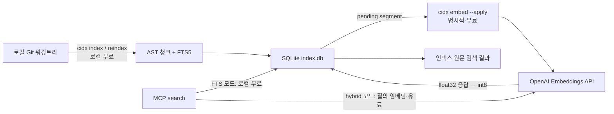

# 로컬 코드 검색 MCP v1 설계 — 2차 정리본

- 상태: 구현 전 2차 설계안
- 작성일: 2026-08-14
- 가칭 바이너리: `cidx`
- 원본 초안: `local-code-search-mcp-v1-design.md`
- 기반 문서: `local-code-search-mcp-v1-design-r1.md`

이 문서는 기존 초안과 1차 정리본을 수정한 문서가 아니다. 지금까지 합의한 내용을 구현 계약 중심으로 다시 정리한 독립 문서다. 수치와 세부 라이브러리는 구현·평가 과정에서 조정할 수 있지만, 비용 경계와 데이터 일관성 계약은 v1에서 바꾸지 않는다. 이 문서는 최소 hit rate나 최대 latency 같은 수치 목표를 v1 출시 조건으로 약속하지 않는다.

---

## 1. 제품 정의

`cidx`는 로컬 Git 저장소의 Go/TypeScript 코드를 함수 중심으로 검색하기 위한 작은 MCP 서버다.

> 실제 워킹트리의 함수·메서드·타입을 AST로 잘라 SQLite FTS5에 무료로 인덱싱하고, 사용자가 명시적으로 선택한 경우에만 OpenAI 임베딩을 추가하여 검색 결과로 원문과 위치를 반환한다.

`cidx`는 IDE, LSP, `rg`, 파일 읽기, 컴파일러와 테스트를 대체하는 단일 도구가 아니다. 코딩 에이전트가 심볼 이름을 정확히 모르는 상황에서 관련 구현 후보를 좁히는 보조 검색 도구다. 다른 도구와 함께 호출되므로 불필요한 원문을 한 번에 밀어 넣지 않고, 호출자가 필요한 인라인 원문의 최대량을 정할 수 있어야 한다.

핵심 목표는 다음 세 가지다.

1. 코딩 에이전트가 저장소 전체를 읽지 않고 관련 함수·메서드·타입 원문을 바로 찾게 한다.
2. 로컬 인덱싱과 유료 API 호출을 분리하여 언제 비용이 발생하는지 명확하게 한다.
3. 그래프·위키·리뷰 자동화 없이 청킹과 검색 품질을 먼저 측정하고 결과를 공개한다.

### 1.1 출발점과 차이

아이디어의 출발점은 [code-review-graph](https://github.com/tirth8205/code-review-graph)다. Tree-sitter로 코드를 구조화하고 MCP를 통해 필요한 부분만 읽게 한다는 문제 설정은 가져온다.

다음 부분은 가져오지 않는다.

- 호출 그래프를 주 검색 경로로 쓰는 방식
- 노드 이름과 짧은 메타데이터 중심의 임베딩
- 커뮤니티 탐지, 리스크 점수, 위키 생성
- 많은 MCP 도구를 한 서버에 노출하는 방식
- 저장소 전체와 소수 검색 결과만 비교한 토큰 절감 수치

v1의 검색 근거는 그래프 노드가 아니라 코드 본문이다. 그래프는 기본 검색의 동작과 평가 결과가 확인된 뒤 별도 기능으로 검토한다.

### 1.2 로컬 보조 도구로서의 최적화 우선순위

`cidx`는 코딩 에이전트의 유일한 정보원이 아니므로 "가능한 모든 코드를 한 번에 반환"하는 방식은 오히려 사용 측 context를 낭비한다. v1의 최적화는 임의의 latency 숫자보다 다음 경계를 우선한다.

1. `search` 요청마다 저장소 전체를 scan·parse하지 않는다.
2. 무료 AST·FTS 갱신과 유료 문서·질의 임베딩을 분리한다.
3. production vector는 int8만 저장하고 SQLite 한 개로 운영한다.
4. 랭킹 결과 수와 inline 원문량을 분리하여 호출자가 필요한 최대 source bytes를 정한다.
5. MCP 도구 수와 반환 schema를 작게 유지하고, 더 필요한 원문은 기존 파일 읽기 도구나 `read_span`으로 확장한다.

hit rate와 latency는 구현 후 비교·회귀 관찰에는 사용하지만 현재 설계의 숫자 목표는 아니다. 기능을 추가하거나 복잡한 index를 도입할 근거는 측정 결과와 실제 사용 요구에서 얻는다.

---

## 2. v1 범위

### 2.1 포함

- Git 저장소 한 개를 루트로 사용하는 로컬 인덱스
- Go, TypeScript, TSX 청킹
- 함수, 메서드, 타입 단위의 검색
- SQLite FTS5 렉시컬 검색
- 공식 OpenAI Embeddings API를 사용한 선택적 벡터 검색
- 256차원 int8 벡터의 전체 스캔
- FTS와 벡터 순위의 RRF 결합
- stdio MCP 서버
- `status`, `search`, `read_span`, `reindex` 네 개 MCP 도구
- 호출자가 검색마다 정하는 인라인 원문 최대 byte와 서버 측 안전 상한
- 수동 인덱싱과 사용자가 기존 post-commit hook에 연결할 수 있는 로컬 인덱싱 명령

### 2.2 제외

- 파일 저장 감시와 실시간 인덱싱
- 자동 임베딩과 암묵적 API 과금
- HNSW 등 ANN 인덱스
- Python과 그 외 언어의 공식 지원
- 호출 그래프, 영향 반경, 리뷰, 위키, 요약
- OpenAI 외 임베딩 제공자
- Azure OpenAI, OpenAI-compatible gateway, custom `base_url`
- 사용자 범위 MCP 등록과 멀티레포 서버
- 호스트 설정 파일을 자동으로 수정하는 installer
- 검색 결과를 LLM으로 다시 작성하는 단계

---

## 3. 시스템 경계

`index`, `embed`, `search`는 서로 다른 작업이다.



| 동작 | 워킹트리 탐색 | SQLite 쓰기 | OpenAI API | 기본 비용 |
| --- | --- | --- | --- | --- |
| `cidx index` | 전체 대상 파일 확인 | AST·FTS·segment 갱신 | 호출하지 않음 | 로컬 |
| MCP `reindex` | `cidx index`와 동일 | AST·FTS·segment 갱신 | 호출하지 않음 | 로컬 |
| `cidx embed` | 하지 않음 | 하지 않음 | 호출하지 않음 | 예상치만 계산 |
| `cidx embed --apply` | 하지 않음 | int8 벡터 저장 | 문서 segment 임베딩 | 유료 |
| `search(mode=fts)` | 결과 파일의 freshness만 확인 | 하지 않음 | 호출하지 않음 | 로컬 |
| `search(mode=hybrid)` | 결과 파일의 freshness만 확인 | 하지 않음 | 질의 임베딩 | 유료 |

`search`는 `index`를 자동 실행하지 않는다. `index`도 임베딩 API를 호출하지 않는다. 이 두 규칙이 비용과 일관성의 기본 경계다.

---

## 4. 저장소 스냅샷과 freshness

### 4.1 인덱스 대상은 HEAD가 아니라 실제 파일이다

`cidx index`는 실행 시점에 디스크에 있는 워킹트리 파일을 읽는다. Git HEAD는 파일 내용을 가져오는 원본이 아니며, 실행 당시 상태를 설명하는 참고 정보로만 저장한다.

따라서 일부 파일만 커밋한 뒤 post-commit hook이 실행되면, 다른 파일에 남아 있는 미커밋 수정도 인덱스 대상이다. 인덱스의 의미는 다음과 같다.

> 특정 커밋의 스냅샷이 아니라, `cidx index` 실행 구간에 실제 워킹트리에서 읽은 파일들로 만든 검색 세대다.

완벽히 같은 한 시점에 모든 파일을 읽는 것은 보장하지 않는다. 대신 각 파일에 대해서는 한 번 읽은 동일한 바이트로 해시와 파싱 결과를 만든다. 인덱싱 중 파일이 다시 바뀌면 저장된 본문과 저장된 해시는 서로 일치하지만 현재 파일과는 `stale`이 되며, 다음 인덱스 실행에서 반영한다.

검색 세대의 정체성은 `active_generation`, index profile fingerprint, 그리고 경로·언어·파일 SHA-256을 정렬해 계산한 `manifest_sha256`이다. Git commit SHA는 이 정체성에 포함하지 않는다.

### 4.2 Git 저장소와 파일 열거

v1은 Git 저장소를 요구한다. 대상 파일은 다음 집합이다.

- Git에 추적된 파일
- 아직 추적되지 않았지만 Git ignore에 걸리지 않은 파일
- 위 집합에서 기본 제외 규칙과 `.cidxignore`를 통과한 파일

개념적으로 `git ls-files --cached --others --exclude-standard`와 같은 집합을 사용한다. 새로 만든 미추적 소스가 검색에서 빠지지 않아야 한다.

기본 제외 대상은 다음과 같다.

- `node_modules`, `vendor`, `dist` 등 의존성·빌드 산출물
- `.git`, `.cidx` 자체
- generated, minified 파일
- lockfile과 `go.sum`
- 설정된 최대 크기를 넘는 파일
- 심볼릭 링크와 일반 파일이 아닌 엔트리

인덱스 루트는 명시적으로 고정하고, 루트 밖으로 해석되는 경로는 거부한다.

### 4.3 `cidx index`의 처리 순서

1. 저장소 루트와 `.cidx/config.json`을 확인한다.
2. index/reindex writer끼리만 공유하는 단일 로컬 인덱스 실행 락을 얻는다. `search`, `status`, `embed`는 이 락을 얻지 않는다.
3. 대상 파일 목록을 만들고 기존 `files` 테이블과 비교해 신규·기존·삭제 파일을 구분한다.
4. 대상 파일 내용을 읽어 SHA-256을 계산한다.
5. 저장된 SHA-256과 같고 index profile도 일치하는 파일은 파싱을 생략한다. index profile mismatch에서는 SHA가 같아도 전부 다시 파싱한다.
6. 신규·변경 파일은 읽어 둔 동일한 바이트를 Tree-sitter로 파싱한다.
7. 함수·메서드·타입 청크, FTS 입력, embedding segment와 `input_sha256`을 만든다.
8. embedding profile만 mismatch라면 파싱을 생략한 기존 파일도 저장된 chunk·projection에서 모든 active segment의 canonical input과 새 `input_sha256`을 다시 계산해 delta에 포함한다.
9. 각 segment를 `(embedding_profile_fingerprint, input_sha256)` key에 연결한다. 같은 key의 유효한 int8 vector가 있으면 그대로 재사용한다. 이 단계에서 별도의 `ready` 상태를 쓰지 않는다.
10. 새 generation의 manifest와 변경 delta를 SQLite 밖의 메모리 또는 임시 작업 영역에 준비한다. 준비 중인 데이터는 검색 가능한 테이블에 넣지 않는다.
11. 모든 파일 준비가 성공하면 추가·변경·삭제, FTS 변경, `active_generation`, `head_observed_at_index`, `worktree_dirty_at_index`, `manifest_sha256`, stored profile fingerprint와 성공 run metadata를 하나의 짧은 SQLite write transaction으로 반영한다.
12. 준비나 commit이 실패하면 active generation을 바꾸지 않고 실패 run과 오류만 별도로 기록한다.

파일 내용의 SHA-256이 변경 판단의 기준이다. `mtime`과 파일 크기는 상태 표시나 향후 최적화에 쓸 수 있지만 정확성의 기준으로 사용하지 않는다.

파싱, 해시 계산, canonical input 생성은 SQLite 쓰기 트랜잭션 밖에서 수행한다. 준비하는 동안 검색은 기존 generation을 계속 사용한다. 최종 publish transaction이 commit되면 SQLite MVCC에 의해 새 상태가 한꺼번에 보인다.

**검색 세대 가시성 불변식:** 검색이 read transaction에서 `G=active_generation`을 읽었다면 manifest, stored profile, files, chunks, projections, symbols, FTS 통계와 후보, embedding segments, vector coverage, 반환 원문은 모두 같은 committed `G`의 논리 상태에서 나와야 한다. 준비 중이거나 실패한 데이터와 구 generation 데이터는 해당 검색의 랭킹·BM25 통계·coverage에 섞이지 않는다. 검색은 publish 직전의 전체 상태 또는 publish 직후의 전체 상태 중 하나만 본다.

v1은 활성 테이블에 현재 snapshot만 두고, 준비된 delta를 마지막 transaction에서 제자리 갱신하는 방식을 우선한다. 따라서 같은 FTS 테이블에 구·신 generation row를 함께 넣고 결과 단계에서만 필터링하지 않는다. 이 방식과 동등한 가시성을 보장하는 대안을 채택하려면 첫 SQLite spike에서 위 불변식을 먼저 증명해야 한다.

대상 파일 하나라도 읽기 또는 파싱을 안전하게 완료할 수 없으면 새 generation을 활성화하지 않는다. 기존 generation을 그대로 유지하고 실패한 run과 파일 오류를 별도 기록한다. Tree-sitter의 복구 가능한 syntax error node는 곧바로 run 실패로 보지 않지만, 정확한 byte range를 만들 수 없는 파일은 실패로 처리한다. DB 반영 도중 실패해도 SQLite가 전체 전환을 롤백한다.

### 4.4 상태 용어

Git 상태와 인덱스 상태를 섞지 않는다.

| 상태 | 의미 |
| --- | --- |
| `dirty` | 현재 워킹트리가 Git HEAD와 다름 |
| `current` | 현재 파일 SHA-256이 인덱스의 SHA-256과 같음 |
| `stale` | 현재 파일이 존재하지만 SHA-256이 인덱스와 다름 |
| `unindexed` | 검색 대상 파일이지만 인덱스에 없음 |
| `deleted` | 인덱스에는 있지만 현재 워킹트리에 없음 |
| `index_error` | 최근 로컬 인덱싱에서 읽기·파싱에 실패함 |
| `embedding_ready` | 현재 profile/input key에 차원·codec·blob 검증을 통과한 vector가 있음 |
| `embedding_failed` | 유효한 vector가 없고 같은 key의 최근 적용 가능한 요청이 terminal failure임 |
| `embedding_pending` | 유효한 vector가 없고 `embedding_failed`도 아님 |

임베딩 상태는 별도 `ready` 플래그의 값이 아니라 active segment key, 유효한 `vector_cache` row, 최근 failure의 관계에서 위 순서로 파생한다. 과거 실패 기록이 있어도 유효한 vector가 있으면 `ready`가 우선이다. `dirty`와 `stale`도 독립적이다. 예를 들어 미커밋 파일도 `cidx index`를 실행했다면 `dirty=true`, `source_state=current`가 될 수 있다.

### 4.5 `status`, `search`, `read_span`의 디스크 접근

- `status`는 짧은 read transaction에서 `observed_generation`과 manifest·파일 해시 목록을 메모리에 복사한 뒤 transaction을 닫고 저장소 전체를 확인한다. `stale`, `unindexed`, `deleted`를 계산하지만 DB는 갱신하지 않는다. 검사 도중 active generation이 바뀌면 처음 관찰한 generation과 `generation_changed_during_status=true`를 반환한다.
- `search`의 랭킹은 SQLite에 저장된 인덱스만 사용한다. 랭킹이 끝난 뒤 반환할 파일만 중복 제거하여 현재 SHA-256을 확인하고 `source_state`를 붙인다. 저장소 전체를 다시 훑거나 자동 재인덱싱하지 않는다.
- 검색 결과의 조건부 `body`는 현재 디스크가 아니라 인덱싱 당시 저장한 원문이다. `content_source="indexed_snapshot"`을 함께 반환한다. body가 생략되어도 같은 freshness metadata를 반환한다.
- `read_span`은 현재 디스크의 파일을 읽는다. 검색 결과가 준 `indexed_sha256`을 `expected_sha256`으로 요구하고, 현재 SHA-256이 다르면 잘못된 줄 범위를 반환하지 않고 `FILE_STALE`, 파일이 없으면 `FILE_NOT_FOUND` 오류를 낸다.

`status`와 index/reindex의 scan·hash·parse 준비는 application-wide mutex나 긴 DB transaction을 잡지 않으며, 그동안 `search`가 기존 generation을 읽을 수 있어야 한다. 이는 latency SLA가 아니라 긴 관리 작업 때문에 검색을 직렬 대기시키지 않는 동시성 계약이다.

예시:

```text
10:00  cidx index        파일 A v1을 AST+FTS에 저장
10:05  파일 A를 v2로 수정
10:06  search            v1을 검색하고 source_state=stale 표시
10:07  cidx index        v2를 AST+FTS에 저장, 변경 segment는 pending
10:08  search(fts)       v2를 즉시 검색
10:10  cidx embed --apply
10:11  search(hybrid)    v2의 FTS와 벡터를 함께 검색
```

---

## 5. 청킹과 렉시컬 인덱스

### 5.1 검색 단위

v1의 source chunk는 다음 세 종류다.

- 함수
- 메서드
- 타입

상수와 변수는 exported 여부와 관계없이 독립 청크나 고가중 심볼로 만들지 않는다. 다만 TypeScript의 `export const handler = () => ...`처럼 변수 선언에 묶인 함수 표현식은 함수 청크이며, `handler`를 함수 심볼로 사용한다.

언어별 청커는 다음 정보를 만든다.

- `kind`
- 단순 심볼과 qualified 심볼
- 시그니처
- 원본 파일의 byte·line 범위
- 인덱스 snapshot의 권위 원문인 정확한 `source_body`
- FTS와 임베딩에 사용할 source range projection

### 5.2 타입과 메서드 중복

타입 청크와 그 안의 메서드 청크가 같은 메서드 본문을 두 번 색인하지 않게 한다.

- 함수·메서드 청크는 전체 본문을 색인한다.
- 타입 청크는 타입명, 선언, 필드·프로퍼티, 메서드 시그니처를 색인한다.
- 타입 청크의 FTS·임베딩 입력에서는 중첩 메서드 본문을 제외한다.
- 저장된 `source_body`는 원본의 연속 범위를 유지한다. 색인용 projection과 저장 원문을 구분하며, 검색 응답에 실제로 inline하는 양은 §8.3의 `max_inline_bytes`가 제한한다.

projection은 별도 본문 사본으로 저장하지 않고, `source_body` 안에서 사용할 byte range 목록으로 표현한다. range는 `source_body` 기준 0-based half-open `[start_byte, end_byte)`이고 source 순서로 정렬되며 서로 겹치지 않는다. 외부에 반환하는 line 범위만 원본 파일 기준 1-based inclusive다.

### 5.3 긴 함수

함수·메서드·타입이라는 source chunk 단위는 유지한다. 다만 임베딩 모델 입력이나 검색 품질에 불리할 정도로 길면 하나의 source chunk에 여러 embedding segment를 연결한다.

- segment 경계는 AST statement 또는 declaration 경계를 사용한다.
- 임의 byte 수로 자르지 않는다.
- 각 segment에는 canonical embedding projection과 별도로 이를 덮는 연속된 source display range를 둔다. segment만 inline할 때는 projection range를 이어 붙인 가공 텍스트가 아니라 이 display range의 정확한 indexed source slice를 반환한다.
- FTS는 source chunk 단위로 검색한다.
- 벡터는 segment 단위로 점수를 계산한 뒤, 같은 source chunk에서는 최고 segment 점수를 chunk 점수로 사용한다.
- 결과는 맞은 segment 범위와 부모 source chunk 범위를 함께 반환한다.

정확한 길이 기준과 overlap 여부는 평가로 결정하며 프로필에 포함한다.

### 5.4 FTS5 입력

FTS5는 다음 두 논리 필드를 갖는다.

- `symbols`: 함수명, 메서드명, 타입명, qualified 이름. 높은 BM25 가중치.
- `body`: 시그니처와 projection 본문. 낮은 BM25 가중치.

camelCase, PascalCase, snake_case는 원문과 분해형을 함께 넣는다. 예를 들어 `GetUserByID`는 원문과 `get user by id`를 모두 검색할 수 있어야 한다.

사용자 쿼리를 그대로 FTS `MATCH` 문법으로 실행하지 않는다. 식별자·일반 토큰을 정규화하고 안전하게 구성한 쿼리만 사용한다. 정확한 심볼 일치는 작은 tie-break로만 사용하며, 평가셋에 맞춘 큰 배수 부스트는 기본값으로 두지 않는다.

FTS 테이블은 검색용 토큰만 보유하는 contentless 구성을 우선한다. 인덱스 원문은 `chunks.source_body`가 권위지만 매 검색마다 전부 반환한다는 뜻은 아니다.

---

## 6. 프로필과 무효화

로컬 인덱스 규칙과 임베딩 규칙을 하나의 프로필로 묶지 않는다.

### 6.1 index profile

다음 변경은 같은 파일 SHA-256이라도 AST+FTS 전면 재생성이 필요하다.

- 지원 언어와 언어별 chunker 버전
- source chunk 및 projection 규칙
- 긴 source chunk의 embedding segment 경계 규칙
- 심볼 정규화 규칙
- FTS 스키마·tokenizer 규칙
- 기본 제외 규칙 중 검색 결과에 영향을 주는 부분

### 6.2 embedding profile

다음 변경은 AST+FTS를 유지한 채 active segment의 profile/input key를 다시 계산하게 한다.

- 모델
- dimensions
- metric
- 임베딩 입력 텍스트 포맷
- int8 양자화 포맷

두 프로필은 canonical JSON의 SHA-256 fingerprint로 DB에 저장한다. 스키마 migration version과 프로필 version은 별개다.

`return_k`, `candidate_k`, 기본 검색 모드, 유료 질의 허용 여부, 응답 byte 상한은 serving policy다. 프로필에 포함하지 않으며 재인덱싱이나 재임베딩을 유발하지 않는다.

설정 초안:

```json
{
  "version": 1,
  "index_profile": {
    "version": 1,
    "languages": ["go", "typescript"],
    "chunkers": {
      "go": 1,
      "typescript": 1
    },
    "projection_version": 1,
    "embedding_segment_version": 1,
    "symbols_version": 1,
    "fts_version": 1
  },
  "embedding_profile": {
    "version": 1,
    "model": "text-embedding-3-small",
    "dimensions": 256,
    "metric": "cosine",
    "text_format_version": 1,
    "quantization": "int8",
    "quantization_version": 1
  },
  "search": {
    "default_mode": "fts",
    "allow_paid_query_embedding": false,
    "return_k": 5,
    "candidate_k": 20
  }
}
```

MCP 서버에는 operational 설정 `mcp.hard_max_inline_bytes`도 둔다. 이는 양의 정수이며 `search` 결과 전체에 inline할 수 있는 source bytes와 `read_span` 한 번이 반환할 수 있는 source bytes의 서버 안전 상한이다. 누락하면 바이너리의 안전 기본값을 사용하고, 지원 절대 상한을 넘거나 잘못된 값이면 서버 시작을 거부한다. 실제 기본 숫자는 초기 응답 크기 측정 후 정하므로 위 profile 중심 예시에는 임의 값을 넣지 않았다. 설정 변경은 다음 `serve` 시작부터 적용되며 profile fingerprint를 바꾸지 않는다.

`config.json`은 사용자가 원하는 프로필이고 DB의 stored fingerprint는 현재 적용된 프로필이다. `status`는 두 값을 비교해 필요한 작업을 쓰지 않고 보고한다. `cidx index`는 실행 시작 시 다음 reconciliation을 수행한다.

- index profile mismatch: 모든 파일을 다시 파싱하여 새 generation을 만든다.
- embedding profile mismatch: 저장된 chunk·projection에서 canonical 입력과 `input_sha256`을 다시 계산해 새 active segment key를 만든다. 현재 key에 유효한 vector나 적용 가능한 terminal failure가 없으면 상태가 `pending`으로 파생된다. AST+FTS는 다시 만들지 않는다.

segment 경계는 AST 정보가 필요하므로 index profile에 둔다. 모델·차원·입력 formatter·양자화처럼 저장된 segment만으로 다시 계산할 수 있는 규칙은 embedding profile에 둔다.

config fingerprint와 DB의 stored fingerprint가 다를 때 외부 동작은 다음으로 고정한다.

- `status`: mismatch와 필요한 local reconciliation을 보고하고 쓰지 않는다.
- `search(mode=fts)`: 기존 active generation의 FTS를 계속 사용하되 profile mismatch를 응답에 표시한다.
- `search(mode=hybrid)`: OpenAI API를 호출하지 않고 FTS-only로 fallback하며 `PROFILE_RECONCILIATION_REQUIRED`를 반환한다.
- `cidx embed`와 `cidx embed --apply`: `PROFILE_RECONCILIATION_REQUIRED`로 실패한다.
- `cidx index`와 MCP `reindex`: 동일한 원자적 publish 절차로 새 generation에서 reconciliation을 수행할 수 있는 유일한 경로다.

v1 설정에서 비공식 provider나 `base_url` 필드를 발견하면 무시하지 않고 호환되지 않는 설정으로 거부한다.

`cidx init --model`은 새 config의 초기값만 정한다. 기존 config를 다시 초기화하며 조용히 바꾸지 않는다. v1에서 프로필 변경의 권위는 사용자가 수정한 `config.json`이며, 다음 `status`가 필요한 reconciliation을 보여 주고 다음 `cidx index`가 적용한다. 파싱할 수 없거나 지원하지 않는 값이면 DB를 건드리기 전에 실패한다.

---

## 7. 유료 임베딩

### 7.1 제공자와 모델

프로덕션 경로는 공식 OpenAI Embeddings API만 지원한다.

- endpoint: `POST https://api.openai.com/v1/embeddings`
- 기본 모델: `text-embedding-3-small`
- 비교 모델: `text-embedding-3-large`
- 출력 차원: 256
- 유사도: cosine
- 프로덕션 저장: int8만

요청은 `dimensions=256`, `encoding_format=float`를 명시하고 반환 float32를 검증한 뒤 int8로 바꾼다. OpenAI 공식 문서는 `text-embedding-3` 계열에서 `dimensions` 매개변수로 출력 차원을 줄이는 방식을 지원하고, 코드 검색에서 코드와 자연어 쿼리를 같은 임베딩 모델로 비교하는 방식을 설명한다. 실제 요청 배치 크기와 입력 상한은 구현 시 공식 API 응답과 현재 문서를 기준으로 검증한다.

### 7.2 임베딩 입력과 해시

segment의 canonical 입력은 다음 요소로 만든다.

```text
relative path
kind
qualified symbol
signature
projected segment body
```

`text_format_version=1`은 byte-level 재현 규칙이다.

- 입력 문자열은 유효한 UTF-8이다.
- 상대 경로 구분자는 `/`로 통일한다.
- `path`, `kind`, `symbol`, `signature`, `body`를 위 순서의 label과 LF(`\n`) 구분자로 조립한다.
- CRLF와 CR은 LF로 정규화하지만 그 밖의 본문 공백은 바꾸지 않는다.
- projection range는 source 순서로 이어 붙이고 range 사이에 LF 하나를 넣는다.
- 최종 문자열은 LF 하나로 끝난다.

`input_sha256`은 `SHA-256(embedding_profile_fingerprint || NUL || canonical_input_utf8)`로 계산한다. embed 직전에 같은 규칙으로 입력을 다시 만들고 저장된 hash와 일치하는지 검사한다. 다르면 API를 호출하지 않고 index corruption 또는 profile reconciliation 오류로 처리한다. 별도의 `content_hash`와 `embed_hash`를 동시에 두지 않는다.

- 파일 SHA-256: 파일을 다시 파싱할지 결정
- `input_sha256`: 유료 임베딩을 재사용할지 결정

파일이 바뀌면 파일 전체를 다시 파싱한다. 그러나 바뀌지 않은 함수의 canonical 입력과 프로필이 같다면 기존 int8 벡터를 재사용한다. 경로가 입력에 포함되므로 파일 이동은 기본적으로 새 임베딩 대상이다. 안정 chunk ID나 rename 추적은 v1에 넣지 않는다.

### 7.3 실행 계약

`cidx embed`는 기본적으로 다음 내용만 계산하고 종료한다.

- pending segment 수와 distinct input 수
- 예상 입력 토큰
- 예상 비용
- 배치 수

`--apply`를 명시한 경우에만 API를 호출한다.

입력 token 추정치는 항상 표시할 수 있지만 USD는 변동 가능한 가격표에 의존한다. USD를 표시할 때는 사용한 model 가격과 기준일을 함께 출력하며, 알 수 없는 model 또는 오래된 가격표에서는 임의 값을 만들지 않고 `unknown`으로 표시한다.

1. 현재 embedding profile에서 active segment가 참조하는 distinct key를 읽는다. 유효한 `vector_cache`가 있는 key와, `--retry-failed` 없이 terminal failure가 남은 key를 제외한 나머지가 이번 pending 입력이다.
2. 각 key의 canonical 입력을 인덱스에 저장된 `source_body`와 projection에서 재구성한다. 현재 워킹트리 파일을 읽지 않는다.
3. 같은 input key는 한 번만 포함하여 모델 제한 안에서 배치를 만든다.
4. 공식 OpenAI API를 호출한다.
5. 응답 개수, 응답 index, 차원, NaN/Inf를 검사한다.
6. float32 응답을 int8로 양자화하고 필요한 scale·norm·codec version과 함께 저장한다.
7. float32 응답은 폐기한다.

일시적인 네트워크 오류와 제한 응답만 bounded retry한다. 인증 오류, 잘못된 모델, 잘못된 차원처럼 재시도로 해결되지 않는 오류는 즉시 failure로 기록한다. 다음 일반 실행은 파생된 `pending`만 처리하며, `failed` key는 `--retry-failed`를 명시해야 다시 호출한다. 입력이나 embedding profile이 바뀌면 새 key에 vector나 failure가 없는 한 `pending`으로 파생된다.

명시적인 평가 실행에서만 float32 응답을 별도 파일로 저장할 수 있다. `--eval-f32-out`은 `--apply`와 함께만 허용하고, 기본적으로 그 실행에서 요청한 입력만 담는다. 전체 active generation 비교가 필요하면 `--force-all`을 함께 사용한다. 산출물 manifest에는 embedding profile fingerprint, `input_sha256`, active generation, `scope=batch|all`과 completeness를 기록한다. 프로덕션 서버는 이 파일을 읽지 않는다.

### 7.4 동시 실행

- 한 번에 하나의 `embed --apply`만 허용하여 같은 입력에 중복 과금되는 것을 막는다.
- API 호출 중에는 SQLite write transaction을 열어 두지 않는다.
- 응답 저장용 write transaction 안에서 현재 active generation에 같은 profile fingerprint와 `input_sha256`을 참조하는 segment가 하나 이상 있는지 다시 검사한다.
- 재파싱으로 segment ID만 바뀌고 같은 input key가 남아 있다면 벡터를 저장할 수 있다. input key 참조가 사라졌다면 늦게 도착한 응답은 폐기한다.
- 성공 시 int8 vector upsert와 같은 key의 failure 제거를 하나의 짧은 transaction으로 처리한다. `ready`는 vector 존재에서 파생하므로 별도 상태 전환은 없다.
- 실패 응답도 key가 여전히 active이고 유효한 vector가 없을 때만 failure를 upsert한다. `--force-all` 갱신 요청이 실패해도 기존 유효 vector가 있으면 effective state는 계속 `ready`다.
- vector 저장·failure 기록을 위한 짧은 writer transaction은 search reader를 application lock으로 막지 않는다.
- 임베딩 실패는 성공한 AST+FTS를 롤백하지 않는다.

API 키는 `.cidx/config.json`이나 프로젝트 MCP 설정에 기록하지 않는다. `OPENAI_API_KEY` 또는 `CIDX_OPENAI_API_KEY`로만 전달한다. 문서 임베딩을 실행하면 canonical 입력에 포함된 코드가, hybrid 검색을 실행하면 query text가 OpenAI API로 전송된다는 사실을 CLI 확인 문구와 README에 명시한다.

---

## 8. 검색

### 8.1 검색 모드와 비용

`search`는 두 모드를 제공한다.

| 모드 | 동작 | API 호출 |
| --- | --- | --- |
| `fts` | FTS5/BM25만 사용 | 없음 |
| `hybrid` | FTS5 + 질의 임베딩 + int8 scan + RRF | 질의당 1회 이상 가능 |

기본값은 `fts`이고 `allow_paid_query_embedding=false`다. 사용자가 config에서 이 값을 `true`로 바꾼 뒤 `hybrid`를 요청하거나 기본 모드를 바꿨을 때만 질의 임베딩 비용이 발생한다. MCP 호출의 `mode=hybrid`만으로 이 보호 설정을 우회할 수 없다. 문서 segment를 미리 임베딩했더라도 자연어 질의를 같은 모델 공간에 놓으려면 질의 임베딩 API 호출이 필요하다.

유료 질의 허용이 꺼져 있거나, profile reconciliation이 필요하거나, 유효한 문서 vector가 없거나, API 키가 없거나, 질의 임베딩이 실패하면 FTS-only로 degrade하고 `fallback_reason`을 반환한다. 이 경우 검색 자체를 실패시키지 않는다.

### 8.2 랭킹 순서

1. 쿼리에서 식별자형 토큰과 일반 텍스트 토큰을 만든다.
   `effective_k = request.k ?? config.search.return_k`로 정하고 1~20 범위인지 검증한다.
2. `hybrid`이면 짧은 preflight에서 유료 허용, stored embedding profile, 유효 vector 존재 여부를 확인한다. 유효 vector가 하나도 없으면 질의 API를 호출하지 않고 FTS-only로 처리한다. 일부라도 있으면 SQLite transaction을 잡지 않은 상태로 질의를 임베딩한다.
3. SQLite read transaction을 열고 active generation, manifest, stored profile을 다시 읽는다. 질의 vector의 profile과 달라졌다면 vector를 버리고 이 transaction에서 FTS-only로 처리한다.
4. 같은 read transaction에서 FTS5 `candidate_k` source chunk를 얻고, active segment가 참조하는 현재 프로필의 유효 int8 vector만 cosine 전체 스캔한다.
5. segment 점수를 source chunk별 최고 점수로 collapse한다. 같은 함수의 여러 segment가 결과 슬롯을 중복 점유하지 않는다.
6. FTS 순위와 vector 순위를 RRF로 합치고, 정확한 qualified symbol 일치는 작은 tie-break만 적용한다.
7. 상위 `effective_k`를 확정한 뒤 같은 read transaction에서 그 결과의 chunk metadata와 `source_body`, 전체 vector coverage를 메모리에 복사하고 transaction을 닫는다.
8. §8.3의 `max_inline_bytes`에 맞춰 body를 포장한다. 이 단계는 점수·순위·결과 개수를 바꾸지 않는다.
9. 반환할 파일만 중복 제거하여 현재 SHA-256을 확인하고 `source_state`를 붙인다. 이 live annotation은 검색 세대 가시성 불변식의 DB snapshot 밖에서 계산된다.

3~7단계의 manifest, FTS 통계와 후보, segment, vector, chunk, body, coverage는 모두 동일한 read transaction과 동일한 `G=active_generation`에서 읽는다. 다른 transaction으로 body를 다시 읽지 않는다. read transaction은 필요한 body를 복사한 직후 닫고 filesystem freshness 확인 동안 유지하지 않는다.

vector coverage의 분모는 `G`의 embedding segment 수이고, 분자는 그 segment의 현재 profile/input key에 차원·codec·blob 검증을 통과한 vector가 존재하는 수다. global vector cache에 row가 있어도 `G`의 active segment가 참조하지 않으면 랭킹과 coverage에 포함하지 않는다.

coverage가 0보다 크고 100% 미만이어도 v1 `hybrid`는 준비된 vector와 전체 FTS 후보를 결합한다. vector가 없는 신규·변경 함수도 FTS 순위로 결과에 들어올 수 있다. 다만 vector가 있는 segment만 vector 순위를 받는 편향이 있으므로 응답에 `partial_vector_coverage=true`를 명시하고, 평가에 "최근 변경 함수가 pending인 상태"를 포함한다. coverage threshold 정책은 실제 결과를 측정한 뒤 별도 설계 변경으로 검토하며 v1에 암묵적인 hit-rate 기준을 두지 않는다.

### 8.3 검색 결과

`search.max_inline_bytes`는 호출자가 매 요청에 반드시 넣는 0 이상의 정수다. 의미는 응답의 모든 `results[].body`에 포함되는 **인덱스 원문 UTF-8 byte 합계의 최대값**이다.

- JSON metadata, JSON escaping overhead, token 수는 계산에 포함하지 않는다.
- `0`이면 동일 검색에서 확정된 최대 `k`개 결과의 위치·시그니처·freshness metadata만 반환하고 모든 body를 생략한다.
- 서버는 `effective_max_inline_bytes = min(request.max_inline_bytes, mcp.hard_max_inline_bytes)`를 적용한다. 서버 상한 때문에 낮아졌다면 응답에 명시한다.
- 이 값은 FTS/vector 후보, 점수, 순위, 최대 `k`개 결과의 id·순서·개수를 바꾸지 않는다. 실제 match가 `k`보다 적으면 존재하는 결과만 반환한다.
- rank 순서대로 남은 byte를 배정한다. 전체 source chunk가 들어가면 전체를 넣고, 들어가지 않지만 vector matched segment 전체가 들어가면 그 AST-aligned segment만 넣는다. 둘 다 들어가지 않으면 body를 생략한다.
- FTS-only hit에는 matched segment가 없을 수 있다. 전체 chunk가 들어가지 않으면 임의의 byte·line 경계로 자르지 않고 body를 생략한다.
- `source_state=current`인 결과의 더 많은 원문은 부모 범위와 `indexed_sha256`을 사용해 가능한 범위에서 `read_span`으로 명시적으로 요청한다. `stale` 또는 `deleted` 결과는 indexed line 범위를 live 파일에 적용하지 않고 reindex 후 다시 검색하거나 일반 파일 읽기 도구를 사용한다. 한 source line 자체가 서버 byte 상한보다 크면 v1의 line 기반 `read_span`으로는 그 줄을 나눌 수 없으므로 일반 파일 읽기 도구를 사용하거나 서버 상한을 조정해야 한다.

각 응답과 결과는 최소한 다음 정보를 반환한다.

```json
{
  "index_generation": 17,
  "manifest_sha256": "...",
  "requested_max_inline_bytes": 8192,
  "effective_max_inline_bytes": 8192,
  "inline_bytes_used": 3072,
  "max_inline_bytes_clamped": false,
  "inline_limited": false,
  "vector_coverage": 0.84,
  "partial_vector_coverage": true,
  "query_embedding_used": true,
  "fallback_reason": null,
  "results": [
    {
      "path": "internal/auth/service.go",
      "symbol": "Service.Authenticate",
      "qualified_symbol": "auth.Service.Authenticate",
      "signature": "func (s *Service) Authenticate(...) error",
      "kind": "method",
      "parent_start_line": 42,
      "parent_end_line": 87,
      "matched_segment": {
        "start_line": 51,
        "end_line": 68
      },
      "body": "...indexed source body...",
      "body_start_line": 42,
      "body_end_line": 87,
      "body_complete": true,
      "content_source": "indexed_snapshot",
      "indexed_sha256": "...",
      "source_state": "current",
      "score_source": "both"
    }
  ]
}
```

`matched_segment`는 vector hit가 있을 때만 존재한다. `body`가 생략되면 `null`, line 범위도 `null`, `body_complete=false`다. `body`가 있고 `body_complete=false`이면 matched segment의 연속 display range만 실린 것이다. `inline_limited`는 byte 한도 때문에 하나 이상의 결과가 전체 body를 받지 못했는지를 나타낸다. `fallback_reason`은 hybrid가 FTS-only로 내려간 이유이며 body 제한과 섞지 않는다.

byte는 tokenizer와 무관한 전송량 계약이다. 모델·호스트·JSON escaping에 따라 달라지는 token 예산이나 context 적합성을 `cidx`가 보장하지 않으며, token 추정치를 body 선택 로직에 사용하지 않는다.

검색 경로에는 생성 LLM과 요약 단계를 두지 않는다.

---

## 9. 저장 구조

v1 데이터 디렉터리는 저장소 루트의 `.cidx/`로 고정한다. 외부 data directory는 root와 DB를 잘못 연결할 가능성이 있어 v1에서 열지 않는다.

```text
.cidx/
  config.json
  index.db
  index.lock
  embed.lock
```

프로덕션 DB에는 float16이나 float32 벡터를 저장하지 않는다.

### 9.1 SQLite 테이블 초안

- `meta`
  - schema version
  - 적용된 index profile fingerprint
  - 적용된 embedding profile fingerprint
  - active index generation
  - active manifest SHA-256
  - canonical source root
  - `head_observed_at_index`
  - `worktree_dirty_at_index`
  - `last_successful_local_index_at`, `last_index_attempt_at`
  - `last_successful_embedding_at`, `last_embedding_attempt_at`
- `files`
  - relative path, language, indexed SHA-256, observed mtime·size
  - 마지막으로 내용이 바뀐 generation은 진단용으로 둘 수 있으나 snapshot membership의 권위로 사용하지 않음
- `chunks`
  - file id, kind, symbol, qualified symbol, signature
  - start/end byte·line, exact `source_body`
- `chunk_projections`
  - chunk id, projection kind, ordered source byte ranges
- `symbols`
  - chunk id, original name, normalized name
- `chunk_fts`
  - contentless FTS5의 `symbols`, `body`
- `embedding_segments`
  - chunk id, segment number, projection ranges, 연속 source display byte·line 범위
  - embedding profile fingerprint, `input_sha256`
- `vector_cache`
  - embedding profile fingerprint + `input_sha256`를 key로 사용
  - int8 blob, scale, norm, dimensions, codec version
  - 유효한 row의 존재가 `ready`의 유일한 권위
- `embedding_failures`
  - embedding profile fingerprint + `input_sha256`를 key로 사용
  - attempts, error class, last error, last attempted time
  - 성공한 vector가 저장될 때 같은 key의 row를 제거함
- `index_runs`
  - phase, reason, 시작·종료, profile fingerprint
  - `planned | running | succeeded | failed`
  - 파일·청크·segment 수, token/cost estimate, 오류 수
- `index_run_files`
  - run id, path, planned action, outcome, error

segment와 유료 작업 상태 또는 vector를 1:1 소유 관계로 묶지 않고 profile fingerprint와 `input_sha256`으로 연결한다. 여러 active segment가 같은 key를 참조할 수 있고, 파일을 다시 파싱해 segment id가 바뀌어도 같은 입력의 vector와 failure를 재사용할 수 있다. `pending`, `failed`, `ready`는 저장 enum이 아니라 §4.4의 join 규칙으로 계산한다.

`files`부터 `embedding_segments`까지의 활성 데이터는 FK 경로로 하나의 현재 snapshot을 이룬다. v1 우선 구현은 활성 테이블을 final publish transaction에서 제자리 갱신하므로 각 하위 테이블에 generation column을 반복하지 않는다. `vector_cache`와 `embedding_failures`는 generation 전역 cache지만, active segment가 참조하는 key만 해당 generation의 검색·coverage·상태 계산에 참여한다.

참조되지 않는 vector cache와 failure row는 성공한 로컬 인덱스 이후 정리할 수 있다. GC는 현재 active segment가 참조하는 key를 절대 지우지 않으며, 열려 있는 reader snapshot에 영향을 주지 않는 시점에 별도 짧은 transaction으로 수행한다. 되돌리기 cache를 오래 보존하는 정책은 v1 범위가 아니다.

### 9.2 SQLite 실행 정책

- WAL 모드와 reader/writer connection 분리
- bounded `busy_timeout`; 일반 동작에서 `BEGIN EXCLUSIVE` 금지
- index/reindex의 scan·hash·parse와 모든 외부 API 호출은 write transaction 밖에서 실행
- index/reindex writer끼리는 `index.lock`, 유료 embed job끼리는 `embed.lock`으로 중복 실행을 막되 `search`와 `status`는 두 파일 락을 얻지 않음
- process 안의 짧은 writer gate와 SQLite writer lock은 publish, vector/failure 저장 같은 commit 구간만 직렬화하며 scan·parse·API 호출 동안 유지하지 않음
- 준비된 delta의 파일·chunk·projection·symbol·segment·FTS 변경과 generation·manifest·stored profile 전환은 하나의 write transaction으로 publish
- search reader는 publish 전 또는 publish 후 snapshot 하나만 읽고, 한 검색의 FTS, vector, chunk, coverage, metadata는 같은 read transaction에 고정
- 실패 run 기록이 publish rollback에 지워지지 않도록 별도의 짧은 transaction으로 기록할 수 있음
- profile reconciliation은 일반 schema migration과 별도 처리
- schema migration은 서버 시작 전 또는 검색을 받지 않는 maintenance 구간에만 실행하는 예외
- 시스템 SQLite에 FTS5가 있다고 가정하지 않음

WAL은 지연시간 보장이 아니라 동시성 수단이다. status scan, reindex 준비, embedding API 대기 때문에 검색을 application mutex로 직렬 대기시키지 않는 것이 계약이다. 검색 read transaction도 filesystem freshness 검사까지 끌고 가지 않는다.

배포 바이너리는 FTS5가 포함된 SQLite 구현을 사용해야 한다. Tree-sitter grammar도 런타임 다운로드 없이 배포물에 포함한다. 정확한 Go SQLite/Tree-sitter binding과 지원 OS·architecture는 첫 구현 spike에서 함께 잠근다.

---

## 10. CLI와 MCP 계약

### 10.1 CLI

```text
cidx init [--model small|large]
cidx status [--json]
cidx index [--dry-run] [--reason manual|commit]
cidx embed [--dry-run|--apply] [--retry-failed]
           [--eval-f32-out <path> [--force-all]]
cidx serve --root <repository-root>
```

- `init`: Git 루트에 config와 DB를 준비한다. 임베딩 API를 호출하지 않는다.
- `status`: 전체 워킹트리를 확인하지만 DB를 갱신하지 않는다.
- `index`: 실제 워킹트리의 로컬 AST+FTS를 갱신한다. `--dry-run`은 같은 scan·parse 계획을 수행하되 DB를 쓰지 않고 `planned_*` 수치만 출력한다.
- `embed`: 기본은 estimate, `--apply`만 유료 실행이다.
- `serve`: 지정한 저장소 하나의 stdio MCP 서버를 실행한다.

v1은 hook을 설치하거나 제거하지 않는다. on-commit 동작을 원하는 사용자는 기존 Git post-commit hook에서 `cidx index --reason commit`을 호출한다. `--reason`은 실행 이력용일 뿐 읽는 대상을 HEAD로 바꾸지 않는다. `docs/hosts.md`와 README는 기존 hook 및 `core.hooksPath`와 합성하는 예시를 제공한다.

### 10.2 MCP 도구

`status`

- 입력 없음
- 두 profile fingerprint
- 파일·청크 수와 `observed_generation`, `manifest_sha256`
- `dirty` 여부와 `stale`, `unindexed`, `deleted`, `index_error` count. MCP `status`는 전체 파일 목록이나 source body를 반환하지 않음
- active segment와 유효 vector/failure join에서 파생한 segment 기준 vector coverage와 distinct input 기준 ready/pending/failed
- 전체 filesystem 검사 중 generation이 바뀌었는지를 나타내는 `generation_changed_during_status`
- 마지막 성공 및 마지막 시도한 로컬 인덱스·임베딩 시각

`search`

- `query`: 필수
- `k`: 선택, 기본 `config.search.return_k`이며 초기값 5, 최대 20
- `mode`: `fts | hybrid`, 기본 config 값
- `max_inline_bytes`: 필수, 0 이상의 정수. 모든 결과 body에 포함할 indexed source UTF-8 byte의 합계 상한
- 서버 상한을 넘는 요청은 명시적으로 clamp하고 `requested_max_inline_bytes`, `effective_max_inline_bytes`, `max_inline_bytes_clamped`를 응답함
- 별도 `detail`, `verbosity`, `include_body` 모드는 두지 않음

`read_span`

- `path`: 저장소 상대 경로
- `start_line`, `end_line`
- `expected_sha256`: 필수
- 현재 SHA-256이 다르면 `FILE_STALE`
- 현재 파일이 없으면 `FILE_NOT_FOUND`
- 요청한 전체 line 범위가 `mcp.hard_max_inline_bytes` 안이면 중간 절단 없이 반환
- byte 상한을 넘으면 중간 절단 없이 `SPAN_TOO_LARGE`와 서버 `max_bytes`를 반환함. 여러 줄 범위라면 호출자가 line 범위를 나눌 수 있지만, 단일 line 자체가 상한을 넘으면 v1에서는 `read_span`으로 읽을 수 없음

`reindex`

- `dry_run`: 선택, 기본 false
- `cidx index`와 같은 로컬 AST+FTS 작업
- 실제 실행 응답: files scanned/updated/deleted, chunks updated, embeddings reused/pending, `activated_generation`, manifest
- dry-run 응답: `planned_files_updated`, `planned_files_deleted`, `planned_chunks`, `planned_embeddings_reused/pending`
- 외부 API 호출 없음

stdio MCP dispatcher는 서로 독립적인 tool handler를 concurrent하게 실행하고 cancellation을 application service까지 전달한다. 긴 `status`나 `reindex` 요청 하나가 같은 서버 프로세스의 `search` dispatch를 막아서는 안 된다. 실제 SQLite write commit끼리의 짧은 직렬화는 허용한다.

stdout에는 MCP JSON-RPC frame만 쓰고 로그·진행률·진단 메시지는 stderr로 보낸다. 동시 handler의 응답은 request id로 대응하며 완료 순서가 요청 순서와 달라도 된다.

### 10.3 경로 보안

- 절대 경로와 `..`를 거부한다.
- 루트와 대상 경로를 canonicalize한 뒤 루트 내부인지 확인한다.
- symlink를 따라가지 않고 일반 파일만 허용한다.
- `read_span`은 인덱싱 대상이 아니거나 ignore된 파일을 기본적으로 읽지 않는다.
- `cidx serve --root`에 `.cidx/config.json`이 없거나 DB meta의 canonical source root와 다르면 fail-closed한다.

---

## 11. 바이너리 배포와 MCP 호스트 연결

다음 세 작업을 구분한다.

1. `cidx` 실행 파일을 내려받거나 빌드한다.
2. 저장소에서 `cidx init`으로 로컬 인덱스를 준비한다.
3. 해당 저장소의 MCP 프로젝트 설정에 `cidx serve --root <repository-root>`를 등록한다.

실행 파일은 MCP 호스트가 실행할 수 있는 위치에만 있으면 된다. PATH에 둘 수도 있고 프로젝트 설정에서 절대 경로를 사용할 수도 있다. 별도의 `cidx install` 명령은 필요하지 않다.

v1은 호스트 설정 파일을 자동으로 수정하지 않는다.

- Claude Code, Cursor, VS Code 등 호스트별 프로젝트 설정 예시는 `docs/hosts.md`에 제공한다.
- 등록은 project scope만 지원한다.
- 각 MCP 프로세스는 저장소 하나만 담당한다.
- 저장소 루트는 host의 우연한 current working directory에 맡기지 않고 `--root`로 명시한다.
- user scope, 자동 감지, JSON/JSONC 병합, uninstall은 v1 이후로 미룬다.

프로젝트 설정에 API 키 값을 기록하지 않는다. hybrid 검색이나 `embed --apply`가 필요하면 호스트 프로세스가 키 환경 변수를 안전하게 전달하도록 호스트별 문서에서 안내한다.

---

## 12. 패키지 구조

```text
cidx/
  README.md
  LICENSE
  go.mod
  cmd/
    cidx/
      main.go
  internal/
    app/                      # CLI application service 조립
    root/                     # Git root와 명시적 serve root 검증
    config/                   # 설정, canonical profile, 무효화 계획
    store/                    # SQLite schema, migration, reader pool, 짧은 writer commit
    ignore/                   # Git 파일 열거와 .cidxignore
    chunk/
      lang.go
      golang/
      typescript/
    symbol/                   # 심볼 정규화
    index/                    # live-worktree hash, parse, AST+FTS 반영
    embed/                    # OpenAI client, estimate, batch, int8 codec
    search/                   # FTS, vector scan, RRF, freshness 조립
    mcp/                      # 네 개 tool schema와 stdio transport
  testdata/
    golang/
    typescript/
    retrieval/
  docs/
    v1-design.md
    hosts.md
  .github/
    workflows/
      ci.yml
```

의존성 규칙:

- `index`는 `embed`를 import하지 않는다.
- `embed`는 청크나 FTS를 만들지 않는다.
- `search`는 query embedding을 작은 인터페이스로 받으며 공식 API client 구현에 직접 결합하지 않는다.
- `mcp`는 application service만 호출하고 호스트 설정을 알지 않는다.
- 외부 API client, parsing, SQLite 쓰기를 한 package에 섞지 않는다.
- 공개 재사용 API를 예상해 `pkg/`를 미리 만들지 않는다.
- 호스트 installer package는 v1에 만들지 않는다.

---

## 13. 구현 순서

1. SQLite FTS5와 Tree-sitter binding spike
   - FTS5가 포함된 배포 방식
   - Go/TypeScript/TSX grammar 포함 방식
   - 지원 OS·architecture와 CGO 정책
   - incremental FTS publish 전·후 snapshot이 섞이지 않는지 검증
2. config, profile fingerprint, 파생 embedding 상태, store schema와 migration
3. Go 청커와 projection
4. TypeScript/TSX 청커와 projection
5. live-worktree 파일 열거, SHA-256 증분, 삭제·실패·세대 처리
6. FTS5 검색과 symbol normalization
7. 작은 Go/TypeScript 코퍼스에서 렉시컬 청킹·검색 평가
8. OpenAI embedding client, estimate, batch 검증, int8 codec
9. embedding segment 재사용과 profile invalidation
10. int8 brute-force scan과 RRF hybrid 검색
11. FTS/vector/hybrid 및 float32/int8 retrieval 평가
12. CLI와 MCP 네 도구, concurrent dispatch, `max_inline_bytes` 포장
13. 배포와 호스트별 project 설정 문서

검색 품질 평가는 MCP와 호스트 설정 구현보다 앞에서 수행한다. parser → index → search 코어가 완성되면 CLI/MCP 어댑터 없이도 같은 질의셋으로 랭킹을 검증할 수 있어야 한다. 이 단계의 수치는 회귀 baseline을 만들기 위한 측정값이며 r2의 numeric release gate가 아니다.

---

## 14. 평가

평가는 청킹·검색 동작을 비교하고 이후 회귀를 알아보기 위한 것이다. r2는 최소 hit@k/MRR이나 최대 p50/p95 latency를 합격선·SLA로 두지 않는다.

### 14.1 재현 조건

- 평가 저장소와 commit 고정
- clean worktree에서 인덱스 생성
- index profile fingerprint 고정
- embedding profile fingerprint 고정
- 질문과 정답 심볼·파일 목록 공개
- 같은 `candidate_k`, `return_k`, RRF 파라미터 사용

### 14.2 비교군

- 식별자 grep 또는 일반 코드 검색
- FTS-only
- vector-only
- FTS + vector RRF
- `text-embedding-3-small` 256
- `text-embedding-3-large` 256
- 같은 API float32 응답의 float32 랭킹과 production int8 랭킹

### 14.3 후속 관찰 지표

- 파일 hit@1, hit@5
- 심볼 hit@1, hit@5
- MRR
- 검색 p50/p95 latency
- 인덱싱 시간
- DB 크기와 vector scan 메모리
- 문서 임베딩 입력 토큰과 비용
- 질의 임베딩 호출 수와 비용
- inline된 indexed source UTF-8 byte
- 호스트별로 관찰한 최종 응답 token 수

token 수는 tokenizer와 host context 구성에 따라 달라지는 관찰값일 뿐 `max_inline_bytes`의 권위 단위가 아니다. 긴 함수에서 추가 `read_span`이 필요했던 횟수와, 빗나간 검색 뒤 재검색 비용도 함께 관찰한다. 저장소 전체를 매번 읽는 비현실적인 baseline과만 비교하지 않는다.

20만 segment는 지원 약속이 아니라 초기 부하 측정 예시다. 브루트포스 지연과 메모리를 측정한 뒤 v1 권장 상한을 정한다. 상한을 넘는 실제 요구가 확인되기 전에는 HNSW를 넣지 않는다.

### 14.4 필수 동작 검증 시나리오

- index publish 직전과 직후의 동시 검색이 각각 완전한 old/new generation 하나만 관찰함
- index 준비 또는 publish 실패 시 기존 generation이 계속 검색 가능함
- status 전체 scan과 reindex scan·parse 중에도 search가 handler 직렬화나 application lock 때문에 대기하지 않음
- embed 응답 도착 전에 active key가 사라지면 vector/failure가 현재 상태에 붙지 않음
- vector upsert와 같은 key failure 제거가 원자적이며 ready/failed/pending 파생값과 coverage가 일치함
- `max_inline_bytes`가 0, 작은 값, 모든 body가 들어가는 값, server hard max 초과인 경우에도 동일 query/mode의 최대 `k`개 결과 id·순서·개수가 같음
- body가 제한된 `source_state=current` 결과가 정확한 부모 범위와 hash를 반환하고, byte 상한 안의 범위는 `read_span`으로 확장되며 단일 초과 line은 명시적으로 `SPAN_TOO_LARGE`가 됨. stale/deleted 결과는 live 범위로 확장하지 않음

---

## 15. v1 완료 조건

- `init`, `status`, `index`, `reindex`, FTS 검색은 API 키와 네트워크 없이 동작한다.
- `embed --apply`와 `search(mode=hybrid)`만 OpenAI API를 호출한다.
- `search`는 자동으로 인덱스를 갱신하지 않는다.
- `index`는 HEAD blob이 아니라 실제 워킹트리 바이트를 사용한다.
- 미추적·비ignore 소스도 인덱싱된다.
- 변경 파일은 전체 재파싱하되 같은 `input_sha256`의 벡터는 재사용한다.
- 벡터가 없거나 일부만 있어도 FTS 검색이 정상 동작한다.
- `ready`는 유효 vector 존재에서만 파생되고 pending/failed와 vector coverage가 같은 active snapshot을 기준으로 일치한다.
- 늦게 도착한 embed 응답은 현재 active key를 다시 확인하고, vector 저장과 failure 제거는 원자적이다.
- 검색 결과는 indexed snapshot임을 밝히고 현재 파일과의 stale 여부를 표시한다.
- 한 검색의 FTS 통계·후보, chunks, vectors, body, profile, coverage는 generation을 섞지 않는다.
- index publish 실패 시 직전 generation 전체가 계속 검색 가능하다.
- status scan과 reindex 준비, embedding API 대기는 application lock이나 긴 write transaction으로 search를 막지 않는다.
- `search.max_inline_bytes`는 필수이며 0을 허용하고, body 양만 제한할 뿐 랭킹·결과 수를 바꾸지 않는다.
- 서버 hard max 적용과 실제 inline byte 수를 응답에서 확인할 수 있고, 임의 byte 경계로 source를 자르지 않는다.
- `read_span`은 해시가 다른 파일의 잘못된 줄 범위를 반환하지 않는다.
- index와 embed 실패가 이미 사용 가능한 AST+FTS를 손상시키지 않는다.
- production DB에는 int8 벡터만 존재한다.
- MCP 표면은 네 도구로 유지한다.
- 호스트 설정 자동 수정 없이 project scope 설정 예시로 연결할 수 있다.
- hit rate와 latency는 측정·보고할 수 있으나 r2 완료의 수치 조건은 아니다.

---

## 16. 구현 중 측정하고 후속 버전에서 결정할 값

다음 값은 아키텍처 계약이 아니라 구현·평가 결과로 확정한다.

- 긴 source chunk의 segment 분할 기준
- FTS BM25 field weight
- RRF 상수와 candidate 수
- int8 codec의 정확한 scale·normalization 방식
- 배치 크기와 retry 한도
- index 대상 source file 크기 상한
- `mcp.hard_max_inline_bytes`의 기본값과 지원 절대 상한
- int8 전체 스캔의 권장 최대 segment 수
- 지원 OS·architecture 배포 범위
- 제품에 수치 보장이 실제로 필요해질 경우의 hit-rate·latency 기준

source chunk·FTS 산출물에 영향을 주는 변경만 index profile을, vector key·codec에 영향을 주는 변경만 embedding profile을 올린다. candidate 수, 응답 byte 상한, 검색 mode 같은 serving policy 변경은 재인덱싱이나 재임베딩을 유발하지 않는다.

---

## 17. OpenAI 공식 문서 근거

- [Embeddings guide](https://developers.openai.com/api/docs/guides/embeddings): `text-embedding-3` 계열의 `dimensions` 사용, cosine 기반 의미 검색, 코드 함수와 자연어 질의를 같은 모델로 임베딩하는 코드 검색 예시.
- [Create embeddings API](https://developers.openai.com/api/reference/resources/embeddings/methods/create): 공식 `/v1/embeddings` 요청 계약과 모델·입력·dimensions·응답 형식.
